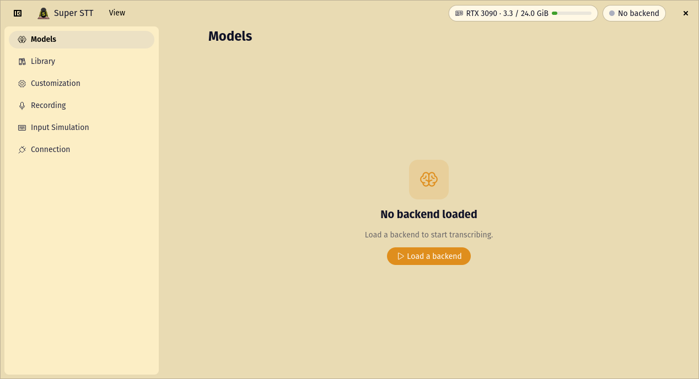
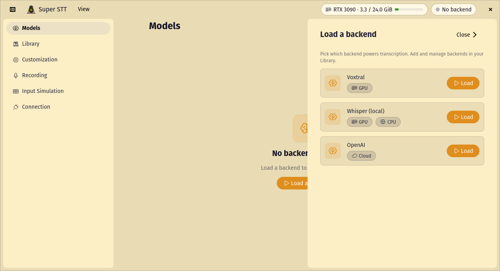
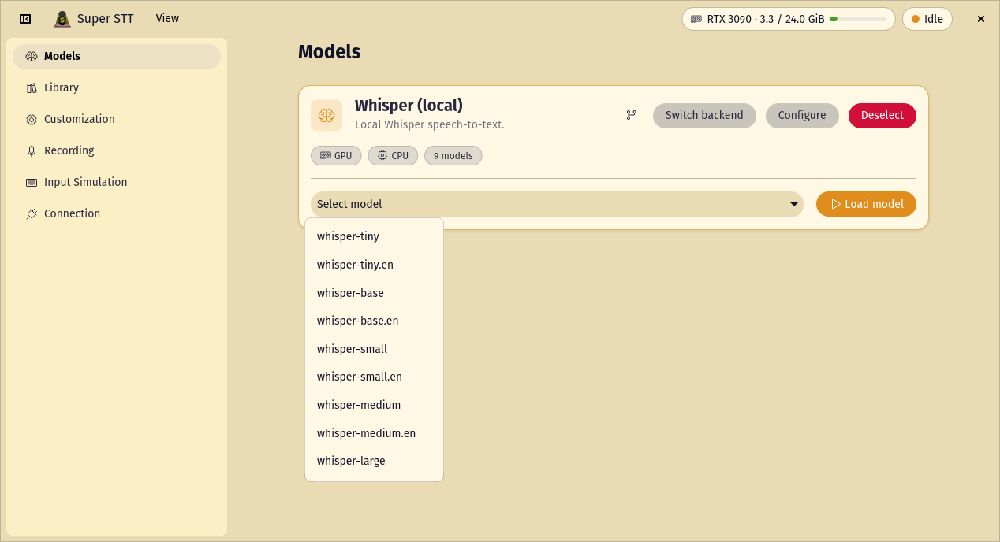
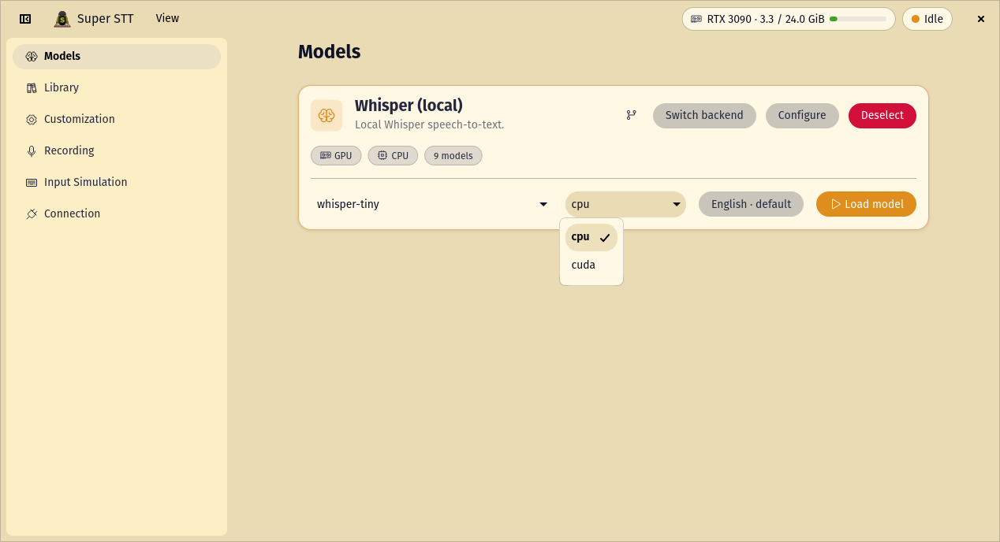
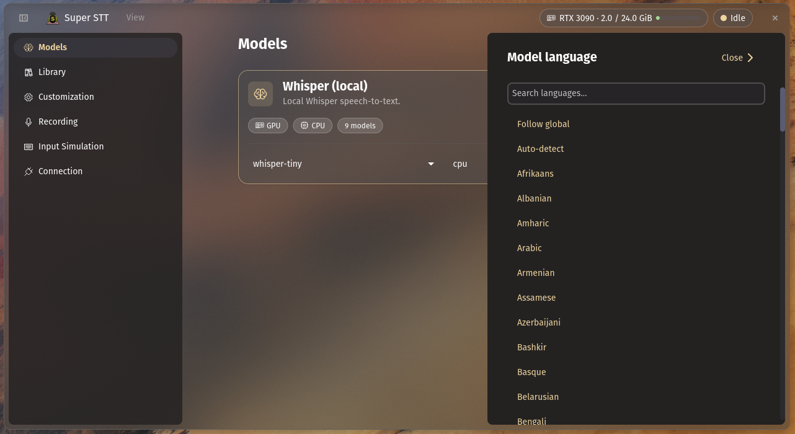
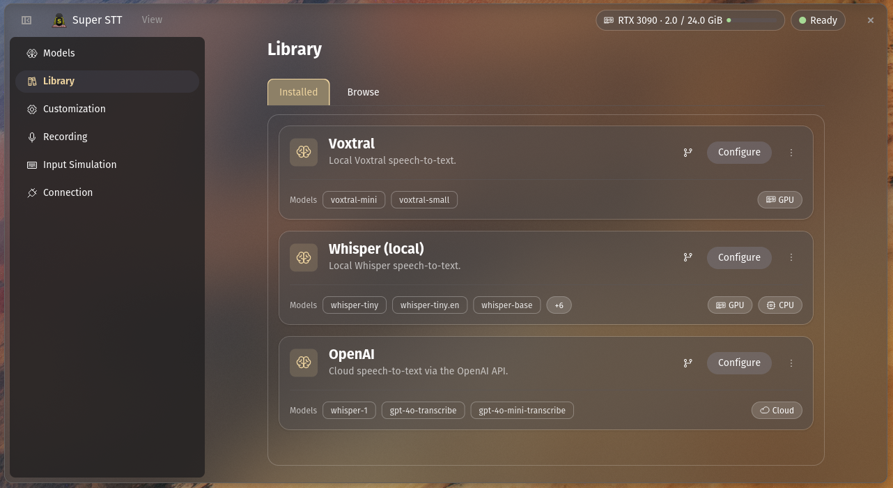
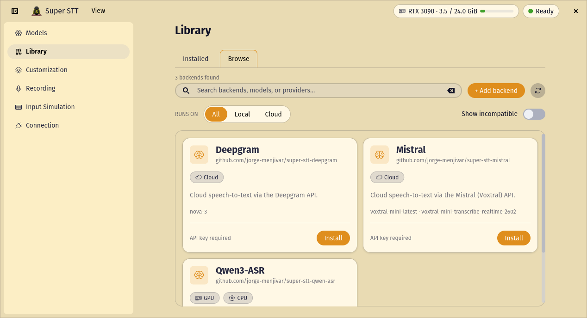
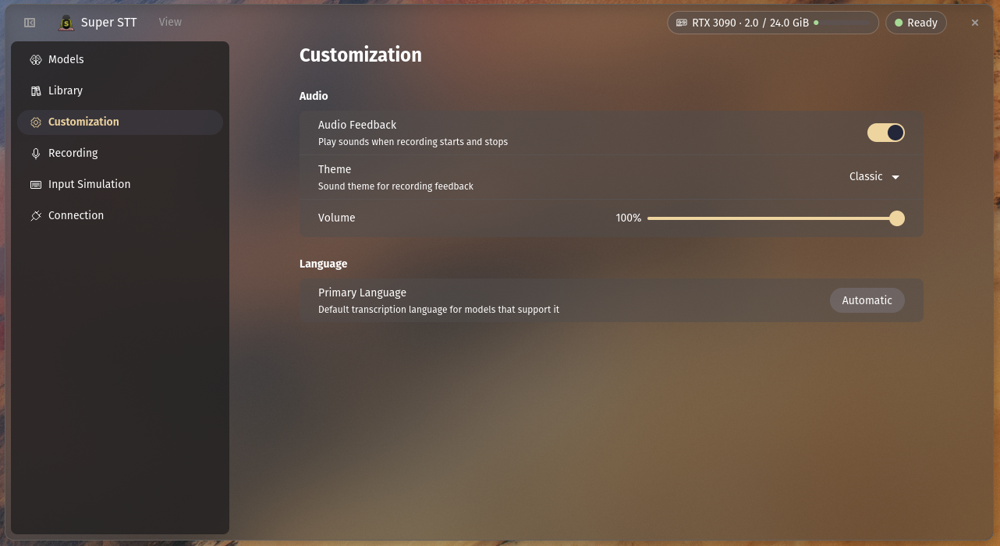
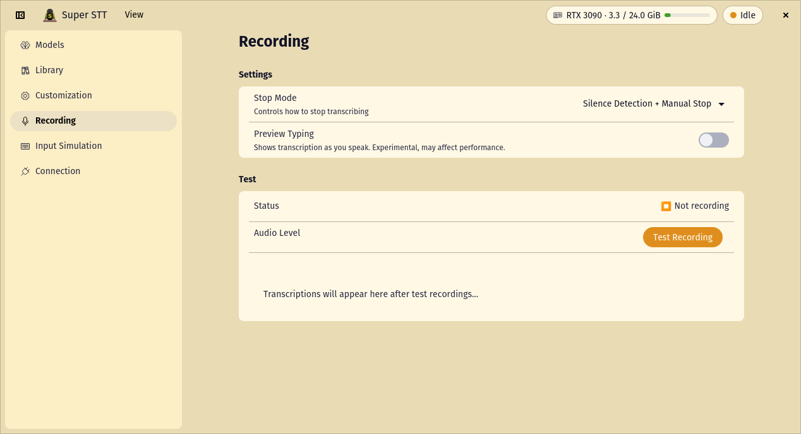
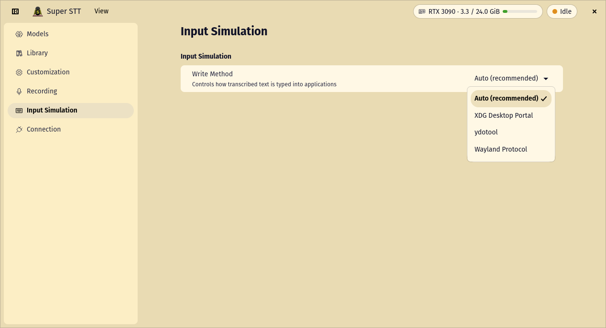

<div align="center">


# Super STT

**Speak into any app on Linux. Your words appear as text.**

*One shortcut to dictate anywhere • Any model from a growing library • An open protocol any app can build on • Built in Rust*

[](https://jorge-menjivar.github.io/super-stt/coverage/)

</div>

https://github.com/user-attachments/assets/bbbe20c3-6802-4797-afc8-aa81d1b48415


## What is Super STT?

Super STT makes speech-to-text with automatic text input **trivial on Linux, for everyone**. Bind a shortcut (Super+Space by convention), speak, and your words are typed straight into whatever app is focused, e.g. your editor, browser, chat, terminal. No copy-paste, no fiddling.

Under the hood it's two things:

- **A model-agnostic engine.** A background daemon installs speech models from a **library** of backends (local or cloud), loads one, and keeps it warm for instant transcription. You pick the model that fits your hardware and swap it whenever you like.
- **An open protocol.** The daemon speaks a documented HTTP protocol over a local socket, so *any* app, in any language, can request transcriptions, stream live audio visualizations, or drive recording, with per-app consent. Super STT's own desktop app, CLI, and COSMIC applet are just the first clients. See [Developers](#-developers).

## 🚀 Installation

**Quick install** - detects your system and downloads pre-built binaries:

```bash
curl -sSL https://raw.githubusercontent.com/jorge-menjivar/super-stt/main/install.sh | bash
```

Append `-s -- --beta` for the latest beta.

**Build from source** - for the very latest changes (needs the [build prerequisites](./CONTRIBUTING.md#prerequisites)):

```bash
git clone https://github.com/jorge-menjivar/super-stt.git
cd super-stt
just install
```

Either way you get the daemon, the `stt` CLI, a consent helper, the desktop app, and (on COSMIC) the panel applet, wired up as a `systemctl --user` service. Everything installs system-wide (root-owned, so the installer asks for sudo), while the daemon itself runs unprivileged in your user session. On COSMIC the installer offers to bind Super+Space → `stt record --write` for you. GPU acceleration comes from the model you run (see [Models](#-models)).

### macOS

The daemon, the `stt` CLI and the settings app all run natively on macOS.
The COSMIC panel applet does not: it needs libcosmic's `applet` feature,
which reaches `cosmic-panel-config`, a Wayland panel library with no macOS
build. The standalone consent helper is Linux-only too — it is a layer-shell
overlay with an exclusive keyboard grab, which is a Wayland idea. The daemon
puts the same consent question up through `osascript` instead, so nothing is
missing, only differently drawn.

Build from source; there are no pre-built macOS binaries yet, and
`install.sh` will tell you so rather than hand you a Linux one:

```bash
git clone https://github.com/jorge-menjivar/super-stt.git
cd super-stt
just install-daemon        # daemon + CLI + global shortcut, as LaunchAgents
just run-app               # opens the settings app
```

The installer also sets up the shortcut. macOS has no desktop-environment
custom shortcut to bind `stt record --write` to, so `stt hotkey` stands in
for one: a small listener, started at login, that owns the key and does what
`stt record --write` does on each press. The default is **⌃⌥Space** (⌘Space
is Spotlight, ⌃Space switches input sources). To use a different one:

```bash
SUPER_STT_HOTKEY="cmd+shift+KeyR" just install-daemon
```

It needs no permission — it registers through Carbon's `RegisterEventHotKey`,
which asks for neither Accessibility nor Input Monitoring. The installer
checks the binding before installing, and the listener logs to
`~/Library/Logs/super-stt/hotkey.log`.

`just install` deliberately skips the settings app on macOS: installing it
would mean a `.desktop` entry and hicolor icons, which macOS does not read,
and the signed `.app` bundle that would replace them does not exist yet. So
the app runs from the build directory via `just run-app` rather than from
`/Applications`.

Then grant two permissions macOS will not let an installer grant for you:

- **Accessibility** — System Settings › Privacy & Security › Accessibility, add
  `/usr/local/bin/super-stt-daemon`. Without it the window server silently
  discards the daemon's keystrokes, so a recording transcribes and then types
  nothing. Building from source, the grant stops matching every time you
  rebuild — the pane still shows the switch on while the check fails. See
  `SUPER_STT_SIGN_IDENTITY` in [CONTRIBUTING.md](./CONTRIBUTING.md).
- **Microphone** — if a recording completes but reports "no speech detected",
  check permissions before suspecting the audio path: a denied process is
  handed a stream of zeros rather than an error, so silence and denial look
  identical from inside.

  The trap is that a grant can *show as enabled and not work*. macOS records
  it against the binary's code-signature requirement, and for an ad-hoc
  signature that requirement is the content hash — so it stops matching when
  the binary is rebuilt or the app is updated, while the System Settings row
  (keyed by path) stays and stays switched on. This applies to your terminal
  as much as to Super STT; several popular terminals ship ad-hoc signed.
  Remove and re-add the entry to fix it; toggling it does not rewrite the
  recorded requirement.

  Inspect what is actually recorded with:

  ```bash
  sqlite3 ~/Library/Application\ Support/com.apple.TCC/TCC.db \
    "select client, auth_value from access where service='kTCCServiceMicrophone'"
  codesign -d --requirements - /path/to/whatever   # cdhash => fragile
  ```

  Building from source, see `SUPER_STT_SIGN_IDENTITY` in
  [CONTRIBUTING.md](./CONTRIBUTING.md) — it signs local builds with a stable
  identity so your grants survive rebuilds.

Manage it with the same `just` recipes as on Linux (`just start-daemon`,
`just status-daemon`, `just logs-daemon`); each dispatches to `launchctl`
instead of `systemctl`. What differs beyond that:

| | Linux | macOS |
|---|---|---|
| Typing | Wayland virtual keyboard, XDG portal, or ydotool | CoreGraphics (`built_in`; the others are Linux-only) |
| Notifications | freedesktop notification server | Notification Center, with no action buttons and no delivery confirmation |
| Consent dialog | the `super-stt-consent` helper | an `osascript` dialog |
| Backend sandbox | `systemd-run --user` with unit hardening | `sandbox-exec`: no network, no writes outside the socket dir |
| Event broadcast | `GET /v1/events` **and** D-Bus signals | `GET /v1/events` only |
| Settings app | installed, launched from your app menu | same app, run with `just run-app`; no `.app` bundle yet |
| Second launch of the app | focuses the running window (D-Bus single-instance) | opens a second window |
| Panel applet | COSMIC only | not available |
| Shortcut | your desktop's custom shortcut runs `stt record --write` (COSMIC's installer binds Super+Space) | `stt hotkey`, installed as a LaunchAgent; ⌃⌥Space by default |

Backends are per-platform too: installing one needs a published
`aarch64-apple-darwin` (or `x86_64-apple-darwin`) asset in the registry, and
the daemon prefers a `metal` build over a `cpu` one where both exist.

## ⌨️ Using it

```bash
stt record --write # Record and transcribes. Types the result after silence is detected or you run the command again.
```

Bind `stt record --write` to a key combo. Super+Space is the convention (the COSMIC installer does this for you; on other desktops add a custom shortcut for `stt record --write`). On macOS the installer sets up ⌃⌥Space instead — see [macOS](#macos). When you trigger it:

1. `stt` asks the running daemon to start transcribing from your mic.
2. You speak; the daemon transcribes your audio.
3. When you stop (on silence or a second trigger), it types the transcription into the focused app.

Manage the daemon with the usual systemd controls:

```bash
systemctl --user start super-stt      # or: enable / status / restart
journalctl --user -u super-stt -f     # follow logs
```

On macOS use the `just` recipes above, or `launchctl` directly against
`gui/$(id -u)/ai.menjivar.super-stt`.

### Recording modes

Two settings shape a session. Both live in the desktop app under **Settings** (or the daemon config); stop mode can also be set per-recording on the CLI.

**Stop mode** - how a recording ends:

| Mode                           | Behavior                                              |
|--------------------------------|-------------------------------------------------------|
| **Silence + Manual** (default) | Stops on silence detection or a second shortcut press |
| **Silence Only**               | Stops only when silence is detected                   |
| **Manual Only**                | Stops only on a second shortcut press                 |

```bash
stt record --write --stop-mode manual_only
```

**Write method** - how text is injected: **Auto** (default) picks the first method the session supports. On Linux that is the built-in Wayland virtual keyboard, then the XDG Desktop Portal, then ydotool; on macOS the built-in CoreGraphics path is the only one. Force a specific one in Settings if auto-detection picks wrong.

## 🤖 Models

Models come from a **library** of backends you install on demand. Open the app, go to **Library → Browse**, install a backend, and it appears in the model selector. Some run **locally** (your audio never leaves your machine); others are **online** providers you reach with your own API, which is stored securely in your system keyring (GNOME Keyring, KWallet, …).

### Recommended models

**Local** - everything stays on your device.

| Model              | Best for                                              |
|--------------------|-------------------------------------------------------|
| **Voxtral** (mini / small) | High accuracy; needs an **NVIDIA GPU** (CUDA). |
| **Qwen3-ASR** (0.6b / 1.7b) | Fast, multilingual; runs on **CPU or an NVIDIA GPU** (CUDA). |
| **Whisper** (tiny → large) | Versatile and battle-tested; `tiny`/`base` are great **CPU** defaults. |

**Online** - bring your own API key.

| Provider   | Notable models                                       |
|------------|------------------------------------------------------|
| **Mistral**  | `voxtral-mini-latest`, plus a realtime Voxtral model |
| **OpenAI**   | `gpt-4o-transcribe`, `gpt-4o-mini-transcribe`, `whisper-1` |
| **Deepgram** | `nova-3`                                              |

> **GPU acceleration** is a property of the model, not a separate build of the app. Install a GPU-capable backend (like Voxtral or Qwen3-ASR) and the daemon downloads the build matched to your NVIDIA GPU automatically. You just need an up-to-date driver.

This is a snapshot. The app always shows the current catalog, published live at [`jorge-menjivar.github.io/super-stt/index.json`](https://jorge-menjivar.github.io/super-stt/index.json). Want a model that isn't there? Anyone can [publish one](./docs/protocol/README.md#add-your-own-model).

## 🖼️ Screenshots

**Models & backends** — load a backend, choose a model, and pick where it runs.

<table>
<tr>
<td align="center"><strong>Clean start</strong><br></td>
<td align="center"><strong>Load a backend</strong><br></td>
<td align="center"><strong>Pick a model</strong><br></td>
</tr>
<tr>
<td align="center"><strong>Run on CPU or GPU</strong><br></td>
<td align="center"><strong>Select language</strong><br></td>
<td></td>
</tr>
</table>

**Library** — browse the catalog and manage what's installed.

<table>
<tr>
<td align="center"><strong>Installed backends</strong><br></td>
<td align="center"><strong>Browse the catalog</strong><br></td>
</tr>
</table>

**Settings** — tune audio feedback, recording behavior, and text input.

<table>
<tr>
<td align="center"><strong>Customization</strong><br></td>
<td align="center"><strong>Recording</strong><br></td>
<td align="center"><strong>Input simulation</strong><br></td>
</tr>
</table>

**Panel visualizer** — the COSMIC applet shows your mic input live in the panel, in three styles.

<p align="center"><strong>Waveforms</strong><br></p>
<p align="center"><strong>Equalizer</strong><br></p>
<p align="center"><strong>Centered bars</strong><br></p>

## 🩺 Troubleshooting

- **`stt: command not found`**: binaries are installed system-wide and are on `PATH` by default — restart your terminal so it rehashes, and check the installer finished without errors.
- **Daemon won't start / misbehaves**: check `journalctl --user -u super-stt -n 50`.
- **Transcriptions seem less accurate than they should be**: your microphone input volume may be set too high or too low. Adjust the mic volume in your system sound settings and try again.
- **Typing doesn't work in some apps**: [`ydotool`](https://github.com/ReimuNotMoe/ydotool) types reliably across virtually all apps. Install it via your package manager, then try it out first by running `sudo ydotoold --socket-path="$HOME/.ydotool_socket" --socket-own="$(id -u):$(id -g)"` in a terminal and setting the write method to **ydotool** in Settings. If that fixes typing, make it permanent by enabling the service (e.g. `systemctl --user enable --now ydotool`).

## 🧑‍💻 Developers

Super STT is built to be built on. The details live in developer-facing docs:

- **Build a client** — get transcriptions, event streams, or recording control into your own app, in any language, over the documented HTTP protocol → **[docs/protocol/](./docs/protocol/)**, with every endpoint in the **[API reference](https://jorge-menjivar.github.io/super-stt/protocol/)**
- **Add your own model** — package a speech model as a backend the daemon can install and run, then publish it to the catalog → **[docs/protocol/](./docs/protocol/)** and **[registry/README.md](./registry/README.md)**
- **Contribute** — build from source, workspace layout, and the PR workflow → **[CONTRIBUTING.md](./CONTRIBUTING.md)**

Architecture and the security model live in **[docs/](./docs/)**.

---

<div align="center">

**Jorge Menjivar** • jorge@menjivar.ai

</div>
