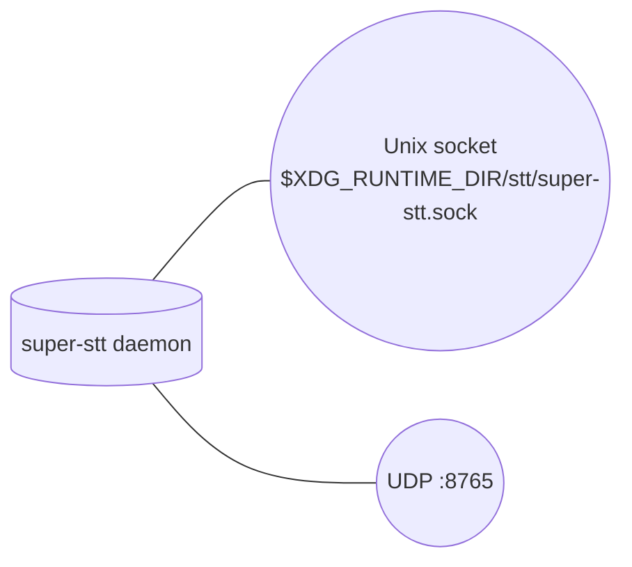
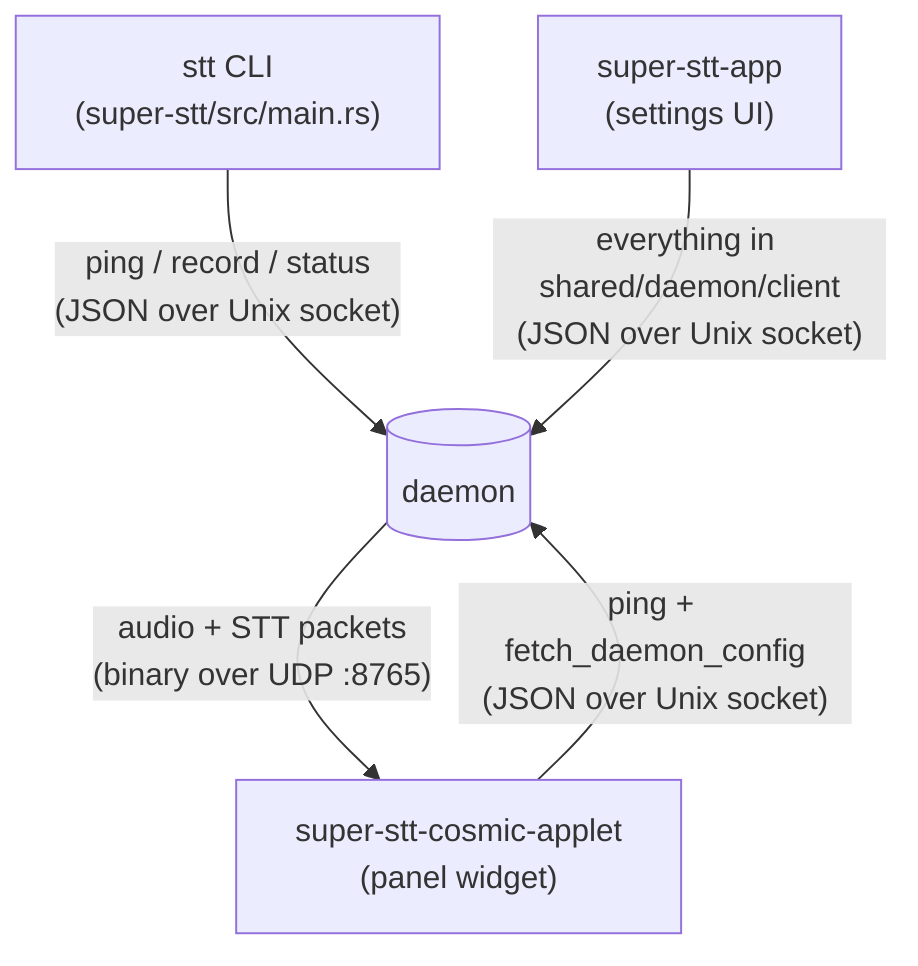
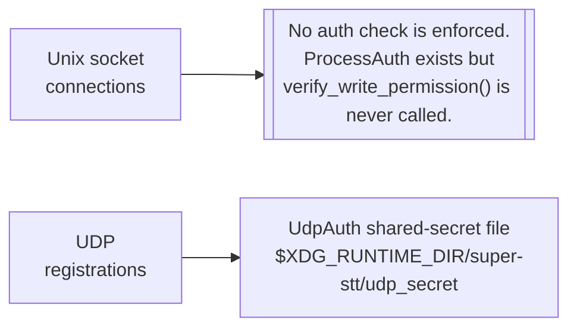

# Current State of the Super STT Protocol

This document describes **what's in the codebase today** — the wire
protocol, transports, in-tree clients, and the existing authentication
mechanisms — without reference to any proposed changes.

For the proposed protocol design, see [`docs/protocol/`](./protocol/).

## How the daemon is reached today

Two transports already exist:



| Transport            | Purpose                                       | Auth today                                     |
|----------------------|-----------------------------------------------|------------------------------------------------|
| Unix domain socket   | Commands, responses, event subscriptions      | None enforced (see "implicit trust" below)     |
| UDP `:8765`          | Audio + STT broadcast fan-out                 | Shared-secret file in `$XDG_RUNTIME_DIR`       |

### Unix socket framing

Every frame is length-prefixed:

```text
[8B big-endian u64 length][N bytes UTF-8 JSON]
```

`DaemonRequest` and `DaemonResponse` are defined in
`super-stt-shared/src/models/protocol.rs`. The accept loop lives at
`super-stt/src/daemon/types.rs::start` and per-connection handling in
`super-stt/src/daemon/client_management.rs::handle_client`.

### UDP packet format

```text
[1B packet_type][4B timestamp_ms LE][4B client_id LE][2B data_len LE][...body]
```

Header struct: `super-stt-shared/src/models/udp.rs::PacketHeader`.
Streamer: `super-stt/src/audio/streamer.rs`.

## The three in-tree clients



### `stt` CLI (`super-stt/src/{main,daemon_main,cli}.rs`)

The thinnest client: connects, sends one request, reads one response (or
a small stream for `record --wait`), exits.

| Subcommand | Sends                                 | Reads                                              |
|-----------|---------------------------------------|----------------------------------------------------|
| `ping`    | (no protocol message — probes socket) | n/a (just the connect attempt)                     |
| `status`  | `command: "status"`                   | one `DaemonResponse` with current model + device   |
| `record`  | `command: "record" + data`            | optional preview frames + final transcription      |

The CLI also bootstraps the daemon when run with no subcommand: that's
the daemon entry point (`daemon_main::run`), which builds a
`SuperSTTDaemon` and starts both the Unix listener and UDP streamer.

### `super-stt-app` (settings UI)

Uses `super-stt-shared::daemon::client` for every interaction. Wraps
each shared call with a per-instance unique `client_id` generated via
`validation::generate_secure_client_id("super-stt-app")`. The full surface
the app touches today (see `super-stt-app/src/daemon/client.rs`):

- `ping`, `fetch_daemon_config`, `test_daemon_connection`
- `record` (streaming preview via `record_command_stream`)
- model: `get_current_model`, `set_model`, `list_available_models`
- device: `get_current_device`, `set_device`
- audio theme: `list_available_audio_themes`, `set_audio_theme`,
  `set_and_test_audio_theme`
- toggles: `set_preview_typing`, `get_preview_typing`,
  `set_recording_stop_mode`, `get_recording_stop_mode`,
  `set_write_method`, `get_write_method`, `set_volume`,
  `set_allow_online_models`, `get_allow_online_models`,
  `set_custom_models_dir`
- downloads: `cancel_download`, `get_download_status`

The app does *not* subscribe to `config_changed` events. Local UI state
is the source of truth for the duration of a settings session.

### `super-stt-cosmic-applet` (panel widget)

Two channels:

- **Unix socket** — only `ping_daemon`, `ping_daemon_with_status`, and
  `fetch_daemon_config`. The applet polls liveness; it doesn't issue
  state-changing commands.
- **UDP `:8765`** — registers as `widget` via the shared-secret protocol
  (`UdpAuth`), then receives raw audio samples / frequency bands /
  recording state / partial+final STT packets to drive its visualization.

UDP loop: `super-stt-cosmic-applet/src/lib.rs::applet_udp_subscription`.
Sends `REGISTER:applet:<secret>`, then a periodic `PING` every minute,
then drops incoming packets through `Message::UdpData` into the iced
event loop.

## Authentication today

There are **two** auth paths in the codebase:



### Unix socket: implicit trust

`super-stt/src/daemon/auth.rs` defines `ProcessAuth` with a
`verify_write_permission` method that checks `SO_PEERCRED` against an
allowlist of `stt`/`super-stt` binary paths. Today **nothing calls it.**

```text
$ rg 'verify_write_permission' super-stt/src
super-stt/src/daemon/auth.rs:39:    pub fn verify_write_permission(...) -> bool {
```

That's the only hit — definition only, no call sites. So in practice,
any process that can connect to the Unix socket (i.e. anyone who can
read `$XDG_RUNTIME_DIR/stt/super-stt.sock`) can issue any command.

The connection accept path (`handle_client`) registers the connection
with the resource manager (rate limiting, idle timeout) but does no
identity check. `process_auth` is a struct field on `SuperSTTDaemon` that
sits idle.

The socket file's filesystem permissions are restrictive (XDG_RUNTIME_DIR
is mode-700 owned by the user), so this is "trust-anything-the-uid-owns"
in security terms — fine for a single-user box, insufficient for any
"the user wants to know which app is doing what" guarantee.

### UDP: shared-secret registration

`super-stt-shared/src/auth.rs::UdpAuth` writes a single secret to
`$XDG_RUNTIME_DIR/super-stt/udp_secret` (mode 600) on first daemon
start. Clients read the same file and embed the secret in their
`REGISTER:<client_type>:<secret>` message.

This authenticates *connections* (anyone with the secret may register)
but not *events*: every registered client receives every audio packet
the daemon broadcasts, with no per-broadcast verification. There's also
no expiry; the secret lives for the lifetime of the daemon process.

## Per-command subscription support today

The daemon has an internal `NotificationManager` component
(`super-stt-shared/src/services/...`) — it's an in-process struct on
`SuperSTTDaemon`, not a separate service or socket peer. It holds the
list of currently-subscribed connections and fans out events over each
subscriber's existing Unix socket. Today the daemon emits at least:

- `recording_started`, `recording_stopped`
- `transcription_completed`
- `preview_text`
- `config_changed`
- `daemon_status_changed`
- D-Bus equivalents (when the D-Bus manager is configured): `listening_started`,
  `listening_stopped`, `audio_level`

Any subscriber receives any event matching the types it subscribed to
— there's no per-client filter. Any client today can listen to any
other client's transcriptions just by passing `event_types:
["transcription_completed"]`.

## Where to look in the source

| Concern                                | Path                                                              |
|----------------------------------------|-------------------------------------------------------------------|
| Wire types (request/response/command)  | `super-stt-shared/src/models/protocol.rs`                         |
| UDP packet types + headers             | `super-stt-shared/src/models/udp.rs`                              |
| Shared client (used by app + CLI)      | `super-stt-shared/src/daemon/client.rs`                           |
| UDP shared-secret auth                 | `super-stt-shared/src/auth.rs`                                    |
| Daemon entry point                     | `super-stt/src/daemon_main.rs`                                    |
| Daemon CLI                             | `super-stt/src/cli.rs`                                            |
| Connection accept + per-conn loop      | `super-stt/src/daemon/{types,client_management}.rs`               |
| Command dispatch                       | `super-stt/src/daemon/core.rs`                                    |
| Per-command handlers                   | `super-stt/src/daemon/handlers.rs`                                |
| Recording lifecycle                    | `super-stt/src/daemon/recording.rs`                               |
| Model loading + management             | `super-stt/src/daemon/{model_management,device_management}.rs`    |
| `ProcessAuth` (defined, unused)        | `super-stt/src/daemon/auth.rs`                                    |
| API key keyring                        | `super-stt/src/keyring.rs`                                        |
| UDP audio fan-out                      | `super-stt/src/audio/streamer.rs`                                 |
| `stt` CLI subcommand handlers          | `super-stt/src/daemon_main.rs::handle_*`                          |
| Settings UI daemon client              | `super-stt-app/src/daemon/client.rs`                              |
| Applet daemon client (Unix socket)     | `super-stt-cosmic-applet/src/daemon/client.rs`                    |
| Applet UDP receive loop                | `super-stt-cosmic-applet/src/lib.rs::applet_udp_subscription`     |
