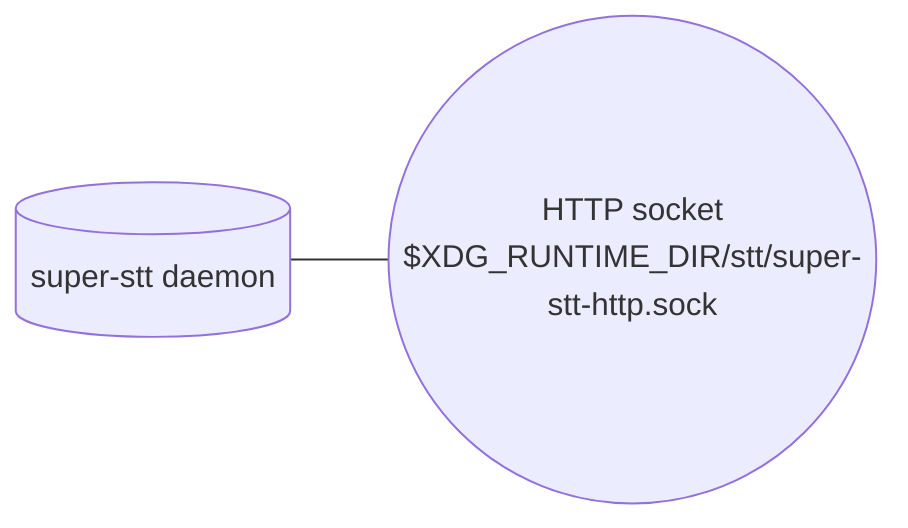
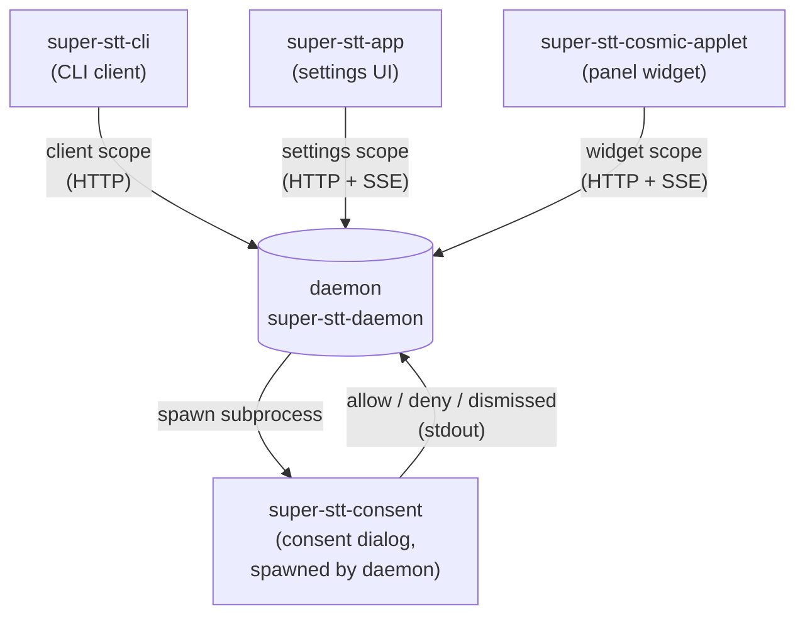
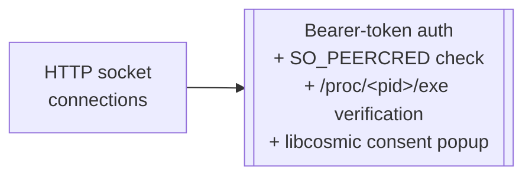

# Current State of the Super STT Protocol

This document describes **what's in the codebase today** — the wire
protocols, transports, in-tree clients, and the existing authentication
mechanisms — without reference to any proposed changes.

For the proposed protocol design, see [`docs/protocol/`](./protocol/).
The internal daemon ↔ backend contract — today a Rust trait, planned
to become a WASM-component plugin interface — is documented at
[`docs/protocol/backend.md`](./protocol/backend.md).

## Workspace layout

```text
super-stt-app/              # libcosmic settings UI
super-stt-cli/              # super-stt-cli command-line client (HTTP)
super-stt-consent/          # libcosmic consent dialog, spawned by daemon
super-stt-cosmic-applet/    # libcosmic panel applet
super-stt-daemon/           # the daemon
super-stt-shared/           # common types, shared HTTP client + session helpers
```

(The daemon binary used to live under a top-level `super-stt/` crate;
that's still where most of the older protocol docs point, but the
sources moved into `super-stt-daemon/` and the public CLI is now its
own crate at `super-stt-cli/`.)

## How the daemon is reached today

The daemon runs **one listener**: HTTP/1.1 + SSE over a Unix domain
socket. The legacy JSON length-prefix listener and the older UDP
audio fan-out are both gone.



| Transport          | Address                                            | Auth today                                                  |
|--------------------|----------------------------------------------------|-------------------------------------------------------------|
| HTTP/SSE socket    | `$XDG_RUNTIME_DIR/stt/super-stt-http.sock`         | Bearer-token; consent popup via `super-stt-consent` subprocess; SO_PEERCRED + `/proc/<pid>/exe` verification |

`daemon_main::run` builds a `SuperSTTDaemon`, spawns the HTTP
listener via `spawn_http_listener`, and parks in
`daemon.wait_for_shutdown()` until SIGINT or `shutdown_tx` fires. The
HTTP server (`super-stt-daemon/src/daemon/http_server.rs`) owns its
socket bind, accept loop, and cleanup; the daemon struct just holds
shared state.

### HTTP/SSE over Unix socket

`super-stt-daemon/src/daemon/http_server.rs` runs an `axum` Router on
`super-stt-http.sock`. Routes currently registered:

| Method  | Route                                | Scope-ish role                                                     |
|---------|--------------------------------------|--------------------------------------------------------------------|
| POST    | `/auth/request`                      | Mints a session token after the consent popup                      |
| GET     | `/ping`                              | Liveness                                                           |
| GET     | `/status`                            | Current model + device                                             |
| POST    | `/transcribe`                        | Start a daemon-mic recording (or one-shot pre-captured)            |
| POST    | `/transcribe/stop`                   | Stop an in-flight daemon-mic recording                             |
| GET     | `/events`                            | Server-Sent Events stream for widget topics                        |
| POST/GET| `/active_model`                      | Set / read active STT model                                        |
| POST    | `/active_model/cancel`               | Abort an in-flight model switch                                    |
| GET     | `/models`                            | List built-in + custom models                                      |
| GET/POST| `/audio_theme`                       | Read / set audio cue theme                                         |
| POST    | `/audio_theme/test`                  | Play current theme's cues                                          |
| GET     | `/audio_themes`                      | List available themes                                              |
| GET/POST| `/volume`                            | Read / set cue volume                                              |
| GET/POST| `/recording_stop_mode`, `/write_method`, `/preview_typing`, `/allow_online_models`, `/active_device`, `/custom_models_dir` | Settings reads and mutations |

Authentication is enforced on every route except `/auth/request`:
`Authorization: Bearer <session_token>` is required, the daemon looks
the token up in its in-memory `TokenStore`, re-resolves the peer's
`/proc/<pid>/exe`, and compares against the stored exe path before
dispatching the handler. Tokens are 32-byte random hex with a 30-day
expiry and are persisted to the system keyring under
`(service: super-stt, user: stt-sessions)` so a daemon restart
re-hydrates the existing set. (`http_server.rs` includes a cooldown
on keyring write failures so a locked keyring can't re-prompt the
user on every mutation.)

Set `SUPER_STT_AUTO_APPROVE=1` in the daemon's environment to skip
the consent popup and auto-approve every `auth_request` — intended
for tests / CI.

## The five in-tree crates



All three GUI/CLI clients go through the shared session helpers in
`super-stt-shared`:

- `super_stt_shared::daemon::http_client` — typed wrappers for every
  HTTP route the daemon exposes.
- `super_stt_shared::daemon::session` — token cache. Layer 1 is an
  in-process `LazyLock<HashMap<AppId, …>>`; layer 2 is the system
  keyring under `service: super-stt-session, user: <AppId>` (one
  entry per app, *not* the same blob the daemon uses).
- `super_stt_shared::daemon::widget_subscription` — self-healing
  consumer for `GET /events`. Wraps the SSE stream in an exponential-
  backoff reconnect loop with an idle deadline; on `401
  invalid_session` it `session::forget`s the cached token and
  re-`obtain`s with consent.

The two keyring stores are distinct:

| Side    | Service            | User key             | Stores                                            |
|---------|--------------------|----------------------|---------------------------------------------------|
| Daemon  | `super-stt`        | `stt-sessions`       | JSON blob: token → `{app_name, scope, exe_path, expires_at}` |
| Client  | `super-stt-session`| per-app `AppId` slug | Bearer token string for that app                  |

### `super-stt-cli` (`super-stt-cli/src/main.rs`)

Pure HTTP client targeting the `client` scope.
`AppId("super-stt-cli")`. Currently exposes four subcommands plus
`logout`:

| Subcommand | What it hits                                                                         |
|------------|--------------------------------------------------------------------------------------|
| `ping`     | `GET /ping`                                                                          |
| `status`   | `GET /status`                                                                        |
| `record`   | `POST /transcribe` — drains the SSE `preview` / `done` / `error` chunks              |
| `stop`     | `POST /transcribe/stop`                                                              |
| `logout`   | `session::forget` — drops the cached client token without involving the daemon       |

Delegates auth to `session::with_token`, which transparently obtains a
token on first call (popup), reuses the keyring-cached token on
subsequent runs, and re-auths once on `invalid_session`.

The CLI in the older repo layout (`super-stt/src/{main,daemon_main,cli}.rs`)
no longer exists as a CLI; the daemon's own `super-stt-daemon` binary
keeps the `daemon_main.rs` entry point but is purely the daemon now.

### `super-stt-app` (settings UI)

`AppId("super-stt-app")`, scope `settings`. Every operation lives in
`super-stt-app/src/daemon/client.rs` and calls through
`http_client::*` with `session::with_token`. The recording-stream
path uses the SSE `/transcribe` endpoint (events `preview`, `done`,
`error`); closing the stream signals stop. Comments in the file:

> All commands here go through the new HTTP protocol. […] Recording
> streaming uses the SSE-based `/transcribe` endpoint with `event:
> preview`, `event: done`, and `event: error` frames. Closing the
> stream mid-recording triggers a server-side stop.

The full surface the settings UI uses today is the same set of
routes the daemon registers above (active_model, audio_theme, volume,
write_method, recording_stop_mode, preview_typing,
allow_online_models, custom_models_dir, active_device), plus a single
SSE subscription on `GET /events?topics=recording_state,frequency_bands,daemon_status_changed,download_progress`.
The first two drive the audio meter / recording badge; the latter
two drive the model-switch progress bar. Settings tokens skip the
`WIDGET_TOPICS` allowlist (god-mode), so widget-scope clients can't
subscribe to `daemon_status_changed` or `download_progress` — those
two topics are settings-only on the daemon side.

### `super-stt-cosmic-applet` (panel widget)

`AppId("super-stt-cosmic-applet")`, scope `widget`. The applet's
lib.rs declares the topics it cares about:

```rust
const APPLET_TOPICS: &[&str] = &["recording_state", "frequency_bands", "audio_samples"];
```

…then hands them and the HTTP socket path to `run_widget_subscription`,
which:

1. Calls `session::obtain` to get a widget token (popup on first run).
2. Opens `GET /events?topics=…` and forwards each SSE frame as an
   internal `WidgetSubscriptionUpdate`.
3. Reconnects with exponential backoff if the stream errors or stalls.
4. Yields a terminal `Blocked` update if the user clicks Deny.

Ping/liveness for the applet runs over `GET /ping` via the same
session-token cache (see `super-stt-cosmic-applet/src/daemon/client.rs`).
`/ping` is the one route that any authenticated token can call (in a
dedicated "any-authenticated" router tier inside
`http_server.rs::build_router`) so the widget scope doesn't need to
borrow client-scope permissions for a liveness probe.

The applet's `lib.rs` still carries `udp_restart_counter` and
`last_udp_data` fields with a comment that the "legacy UDP path is
being deprecated" — they're vestigial and not driven by any
subscription anymore.

### `super-stt-consent` (consent dialog)

A standalone libcosmic binary the daemon spawns as a subprocess from
`http_server.rs` when an app calls `POST /auth/request`. The daemon
passes the request details in three env vars
(`STT_AUTH_APP_NAME`, `STT_AUTH_SCOPE`, `STT_AUTH_EXE_PATH`); the
binary writes one of `allow`, `deny`, or `dismissed` to stdout and
exits. The window is a Wayland layer-shell surface
(`Layer::Overlay`, `KeyboardInteractivity::Exclusive`) so tiling
compositors treat it as a floating overlay.

## Authentication today

The HTTP listener is the only auth surface. Every endpoint except
`POST /auth/request` requires a Bearer token; the token is bound to
the peer's `/proc/<peer_pid>/exe` at issue time and re-checked on
every request.



### HTTP socket: Bearer-token + consent

Every HTTP request except `POST /auth/request` carries
`Authorization: Bearer <session_token>`. The handler middleware in
`http_server.rs` looks the token up in `TokenStore`, compares the
stored `exe_path` against the live `/proc/<peer_pid>/exe`, and
checks the 30-day expiry. On any mismatch it returns
`401 invalid_session` with a `reason` of `unknown`, `expired`, or
`exe_changed`.

`POST /auth/request` is the only unauthenticated endpoint. It:

1. Resolves the peer PID via `SO_PEERCRED`.
2. Reads `/proc/<peer_pid>/exe`.
3. Spawns `super-stt-consent` with `STT_AUTH_APP_NAME`,
   `STT_AUTH_SCOPE`, `STT_AUTH_EXE_PATH` in the environment.
4. Reads `allow` / `deny` / `dismissed` from the helper's stdout.
5. On allow, generates a 32-byte hex token, stores it in
   `TokenStore`, persists the whole map to the system keyring, and
   returns it.
6. On deny, inserts `(app_name, exe_path, scope)` into an in-memory
   deny cache; future `/auth/request` calls for the same triple
   short-circuit until daemon restart.

The HTTP socket and the consent helper together implement the
"approved once, identified by binary path" flow that the
[auth.md](./protocol/auth.md) design calls for.

## SSE events today

The daemon's `EventBus` (`super-stt-daemon/src/daemon/events.rs`)
publishes the following topics over `GET /events`:

```rust
pub enum Topic {
    RecordingStarted,
    RecordingStopped,
    RecordingState,
    AudioSamples,
    FrequencyBands,
    PartialStt,
    FinalStt,
    DaemonStatusChanged,  // settings-scope only
    DownloadProgress,     // settings-scope only
}
```

Implementation:

- One `tokio::sync::broadcast::Sender` per topic, multi-subscriber
  by construction.
- Audio and frequency-band payloads carry their `f32` slice
  base64-encoded into a `*_b64` field on the JSON envelope so the
  SSE frame is self-contained.
- `DaemonStatusChanged` / `DownloadProgress` payloads are
  `serde_json::Value` (the legacy JSON shape — heterogeneous keys
  like `status`, `model_loaded`, `actual_device`, `percentage`, …).
- Ring-buffer depth bounds the replay window: `AUDIO_BUF_CAPACITY =
  256`, `STATE_BUF_CAPACITY = 32`. A slow subscriber gets
  `RecvError::Lagged(n)` and skips ahead; the audio capture pipeline
  never blocks.
- A constant `WIDGET_TOPICS` in `http_server.rs` controls which
  topics the widget scope is permitted to subscribe to.
  `daemon_status_changed` and `download_progress` are deliberately
  **not** in that list, so widget-scope tokens get
  `403 scope_denied` if they try to subscribe.

A `NotificationManager` in `super-stt-shared/src/services` also lives
on the daemon and predates `EventBus`. It's still wired up internally
(certain handlers push into it), but no in-tree client subscribes to
it now — `EventBus` is the only thing the HTTP `/events` route reads
from. The notification manager will likely retire once nothing
publishes through it.

## Per-command subscription support today

The daemon's `EventBus` is the in-process state that backs `GET
/events`. Filtering is per-topic via the `topics=…` query string.
There is no per-event filter beyond that — any client whose token has
access to a topic sees every event on that topic regardless of which
other client caused it.

## Where to look in the source

| Concern                                   | Path                                                                  |
|-------------------------------------------|-----------------------------------------------------------------------|
| Daemon-side wire types (request/response) | `super-stt-shared/src/models/protocol.rs`                             |
| HTTP shared client                        | `super-stt-shared/src/daemon/http_client.rs`                          |
| Client-side session token cache + keyring | `super-stt-shared/src/daemon/session.rs`                              |
| Self-healing widget SSE consumer          | `super-stt-shared/src/daemon/widget_subscription.rs`                  |
| HTTP socket path                          | `super-stt-shared/src/validation/mod.rs::get_http_socket_path`        |
| Daemon entry point                        | `super-stt-daemon/src/daemon_main.rs::{run,spawn_http_listener}`      |
| HTTP server + token store + consent spawn | `super-stt-daemon/src/daemon/http_server.rs`                          |
| Event bus + SSE topic broadcast           | `super-stt-daemon/src/daemon/events.rs`                               |
| Shutdown park loop                        | `super-stt-daemon/src/daemon/types.rs::wait_for_shutdown`             |
| Command dispatch                          | `super-stt-daemon/src/daemon/core.rs`                                 |
| Per-command handlers                      | `super-stt-daemon/src/daemon/handlers.rs`                             |
| Recording lifecycle                       | `super-stt-daemon/src/daemon/recording.rs`                            |
| Model loading + management                | `super-stt-daemon/src/daemon/{model_management,device_management}.rs` |
| Daemon-side keyring helpers               | `super-stt-daemon/src/keyring.rs`                                     |
| CLI client entry point                    | `super-stt-cli/src/main.rs`                                           |
| Settings UI daemon client                 | `super-stt-app/src/daemon/client.rs`                                  |
| Applet HTTP/SSE subscription wiring       | `super-stt-cosmic-applet/src/lib.rs` (`APPLET_TOPICS`, `run_widget_subscription`) |
| Applet liveness probe                     | `super-stt-cosmic-applet/src/daemon/client.rs` (`ping_daemon` over HTTP) |
| Consent dialog binary                     | `super-stt-consent/src/main.rs`                                       |

## How STT backends work today

Every STT backend is a Rust impl of the `Transcribe` trait, compiled
into the daemon binary:

```text
super-stt-daemon/src/stt_models/
├── transcribe.rs                  # the ModelInfo / ModelState / Transcribe traits
├── local/
│   ├── whisper/                   # candle-backed Whisper (CPU + CUDA)
│   └── voxtral/                   # candle-backed Voxtral (CPU + CUDA)
└── third_party/
    ├── openai/                    # HTTPS client to api.openai.com
    ├── mistralai/                 # HTTPS client to api.mistral.ai
    └── deepgram/                  # HTTPS client to api.deepgram.com
```

Models are identified on the wire by `(name, provider, source)`:

- **`name`** — `whisper-tiny`, `voxtral-mini-latest`, …
- **`provider`** — `local_whisper`, `local_voxtral`, `openai`,
  `mistral`, `deepgram`
- **`source`** — `builtin` (in the static registry at
  `super-stt-shared/src/models/registry.rs`), `custom` (discovered in
  `custom_models_dir`), or `online`

The active model lives behind a `Box<dyn Transcribe>` on the daemon
struct. Switching models drops the old box and constructs a new one
inline — there's no plugin sandbox, every backend runs in the daemon
process with full ambient capabilities (filesystem, network, GPU).

The streaming "preview text" path (`stream_realtime: true` on
`/transcribe`) is **not** a model-level streaming API. The daemon
calls `transcribe_audio` repeatedly on a growing audio buffer and
forwards each pass's result as a preview SSE frame. No backend today
exposes incremental decoding to the daemon.

## Upcoming: WASM backend plugins

The planned replacement (designed in
[`docs/protocol/backend.md`](./protocol/backend.md)) lifts the
backends out of the daemon binary entirely. Each backend becomes a
single `.wasm` component on disk, loaded at runtime, sandboxed by
wasmtime. The migration changes:

| Concern                       | Today                                                       | After backend.md lands                                            |
|-------------------------------|-------------------------------------------------------------|-------------------------------------------------------------------|
| Backend abstraction           | `Transcribe` Rust trait                                     | `super-stt:plugin@0.1.0` WIT interface                            |
| Whisper / Voxtral             | In-tree under `stt_models/local/{whisper,voxtral}`          | Separate plugin crates compiling to `wasm32-wasip2`               |
| OpenAI / Mistral / Deepgram   | In-tree under `stt_models/third_party/*`                    | Separate plugin crates using WASI HTTP                            |
| Model registry                | Static `super-stt-shared/src/models/registry.rs`            | Per-plugin manifests, discovered on disk                          |
| Custom models                 | `custom_models_dir` filesystem scan                         | Plugin search path scan (`/usr/lib/super-stt/plugins/`, XDG)      |
| Model identity on the wire    | `(name, provider, source)`                                  | `(plugin, variant)`                                               |
| GPU access                    | candle calls directly                                       | candle behind the daemon's wasi-nn host                           |
| Online API access             | reqwest calls directly                                      | wasi-http through a daemon-enforced TLS + allowlist client        |
| API key storage               | per-provider keyring entries in `super-stt-daemon/src/keyring.rs` | per-plugin keyring entries (`plugin:<id>:<key>`)            |
| `custom_models_dir` setting   | exists                                                      | replaced by `extra_plugins_dir`                                   |

External HTTP surface (`/transcribe`, `/events`, `/auth/*`) keeps
the same wire shape. Only `/active_model`, `/variants` (new), and
the new `/plugins*` endpoints change in `docs/protocol/settings.md`.
