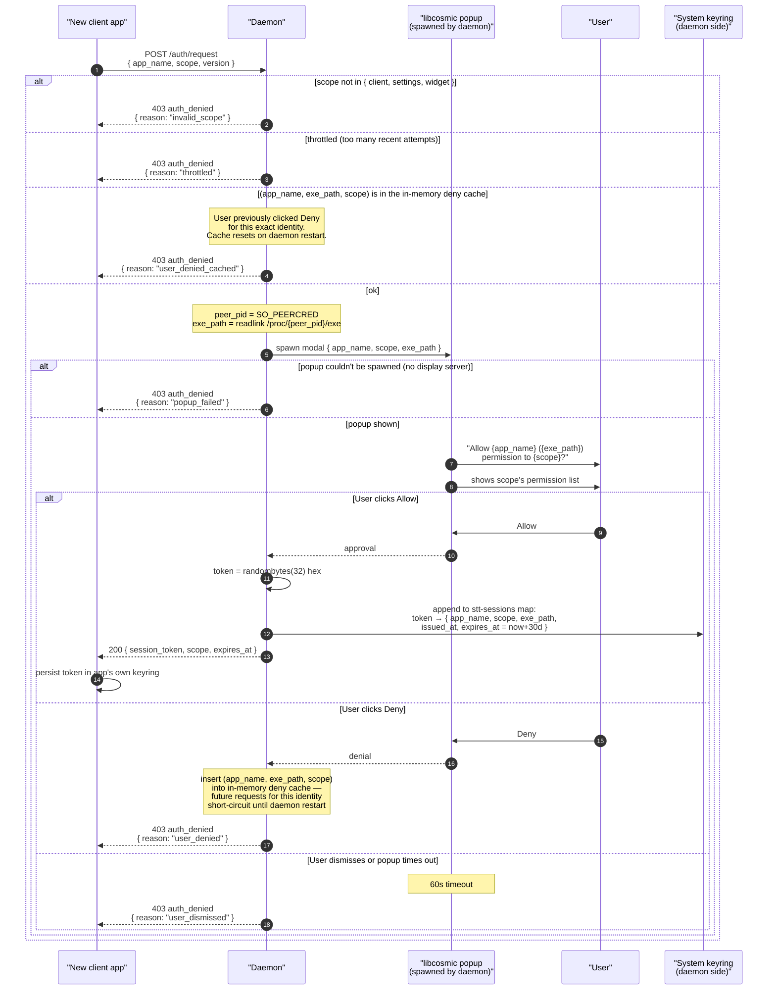
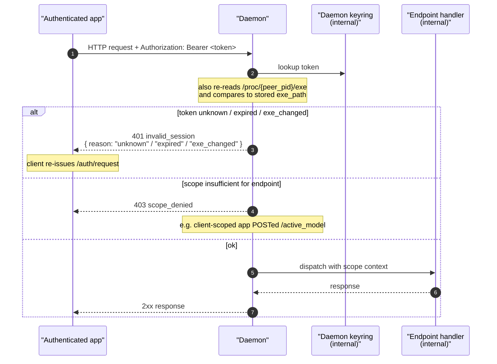
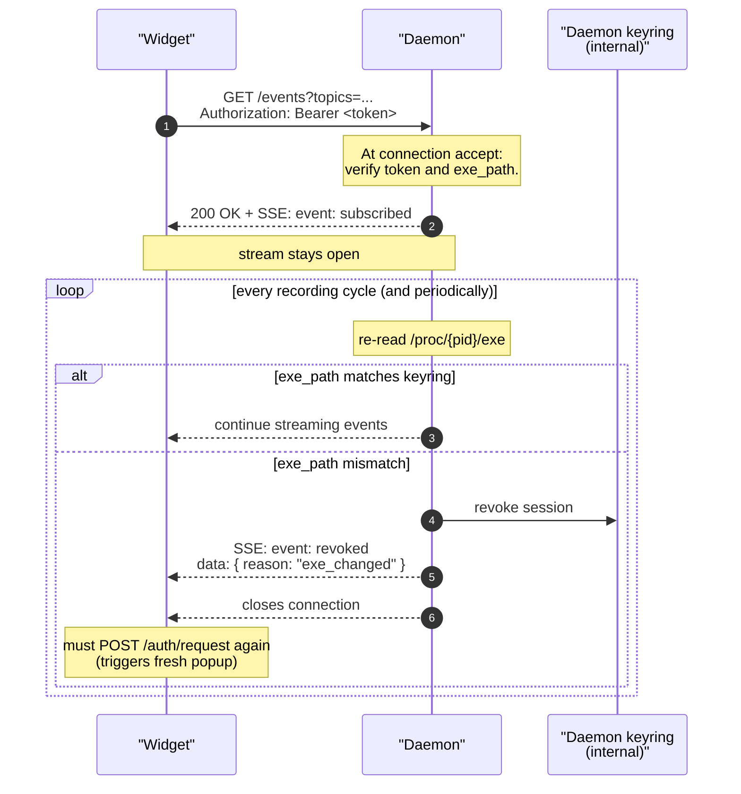

# Authentication

> **Status:** 🔵 *Proposed.* Today the daemon performs no per-app authentication
> on the Unix socket. The design below is the planned replacement; see
> `../current-state.md` for what exists.

This document describes the authentication handshake every client performs
before sending any other request, and how that handshake differs across the three
scopes ([client](./client.md), [settings](./settings.md), [widget](./widget.md)).
For the byte-level connection mechanics (HTTP framing, SSE event streams),
see [transport.md](./transport.md).

## Why this design

A standard STT protocol on Linux needs the same property as a standard PAM
or D-Bus permission prompt: the user must understand *what* binary is asking
for *what* permission, and approve once instead of every time. The daemon is
the only process that knows both:

1. The peer's real executable path (from `/proc/<peer_pid>/exe`,
   not user-supplied).
2. Which scope the requester is asking for (declared in the request).

So the daemon owns the consent UI, mints session tokens, and stores them.
A client can never extend its own scope — it can only present a token the
daemon already approved.

## The three scopes

| Scope        | Permissions                                                                                  |
|--------------|-----------------------------------------------------------------------------------------------|
| **client**   | start/stop recording; receive own preview text and final transcription                        |
| **settings** | everything in `client`, plus read/write every daemon configuration value                      |
| **widget**   | subscribe (read-only) to recording state, audio frames, optional transcription preview        |

A widget cannot mutate state. A `client`-scoped app cannot read or change
settings. A `settings`-scoped app inherits client recording capabilities.

## Endpoints

Authentication is **per-request**, not per-connection. Every request
carries the token in an `Authorization: Bearer <token>` header, and
the daemon validates it before dispatching.

There are exactly two auth endpoints:

| Endpoint              | Method | What it does                                              |
|-----------------------|--------|-----------------------------------------------------------|
| `/auth/request`       | POST   | Trigger the consent popup; mint a fresh session token     |
| `/auth/status`        | GET    | Probe whether the bearer token is still valid (no UI)     |

`POST /auth/request` is the only endpoint that does **not** require an
existing token — it's how a client gets its first one. Every other
endpoint (including `/auth/status`) requires `Authorization: Bearer <token>`.

### POST /auth/request

```http
POST /auth/request HTTP/1.1
Host: stt.local
Content-Type: application/json

{
  "app_name": "Super STT Settings App",
  "scope":    "settings",
  "version":  "0.10.0"
}
```

On approval:

```http
HTTP/1.1 200 OK
Content-Type: application/json

{
  "status":        "success",
  "session_token": "stt_…64hex…",
  "scope":         "settings",
  "expires_at":    "2026-06-04T12:34:56Z"
}
```

On any failure:

```http
HTTP/1.1 403 Forbidden
Content-Type: application/json

{
  "status":  "error",
  "message": "auth_denied",
  "data":    { "reason": "user_denied" }
}
```

| `data.reason`         | Meaning                                                                              |
|-----------------------|--------------------------------------------------------------------------------------|
| `user_denied`         | User clicked **Deny** in the popup.                                                  |
| `user_denied_cached`  | A prior **Deny** for this `(app_name, exe_path, scope)` is still in the daemon's in-memory deny cache. No popup spawned. Cleared by daemon restart. |
| `user_dismissed`      | User closed the popup without choosing, or it timed out (default: 60 s).             |
| `popup_failed`        | Daemon couldn't spawn the popup (e.g. no display server, no Wayland session).        |
| `invalid_scope`       | Requested scope wasn't one of `client`, `settings`, `widget`.                        |
| `throttled`           | Too many auth requests from this peer in a short window — back off and retry later.  |

A client app should treat `user_denied` and `user_denied_cached` as
*don't auto-retry* — the user explicitly said no, looping the popup
(or retrying past a sticky deny) is hostile UX. The recommended UX is
to terminate the in-flight subscription / request loop, surface a
hint that the user must restart the daemon to clear the deny cache
(`systemctl --user restart super-stt`), and offer an explicit
**Retry** affordance that re-issues `/auth/request` only after the
user opts in. The shared `super_stt_shared::daemon::widget_subscription`
helper bakes this in: on `user_denied(_cached)` it emits a terminal
`Blocked` update and the stream ends — the consumer is responsible
for the UI hint and for rebuilding the subscription when the user
clicks Retry. Other `auth_denied` reasons (e.g. `user_dismissed`,
`popup_failed`, `throttled`) are recoverable: re-prompt later, fall
back to read-only mode, or exit cleanly.

### GET /auth/status

```http
GET /auth/status HTTP/1.1
Host: stt.local
Authorization: Bearer stt_…64hex…
```

Valid:

```http
HTTP/1.1 200 OK
Content-Type: application/json

{
  "status":     "success",
  "scope":      "settings",
  "expires_at": "2026-06-04T12:34:56Z"
}
```

Invalid:

```http
HTTP/1.1 401 Unauthorized
Content-Type: application/json

{
  "status":  "error",
  "message": "invalid_session",
  "data":    { "reason": "expired" }
}
```

`auth/status` is purely advisory: the daemon doesn't extend the
expiry on a positive response, and it doesn't trigger the popup on a
negative response. Use it from a CLI/headless client to fail-fast
when the held token is bad, instead of synchronously blocking on a
GUI prompt the host can't display.

## First-time handshake



The popup spawned by the daemon shows three pieces of information:

- **Application name** — declared by the app (untrusted; for UX only).
- **Executable path** — resolved from `/proc/<peer_pid>/exe` (trusted; what
  the user actually approves against).
- **Scope and permissions** — a human-readable list ("can change your STT
  model", "can see live transcription text from this microphone", etc.).

If the user clicks Allow, the daemon:

1. Generates a 32-byte random session token (hex-encoded).
2. Inserts the session (`app_name`, `exe_path`, `scope`, `issued_at`,
   `expires_at`) into its persistent token store — a single keyring
   blob under `(super-stt, stt-sessions)` keyed by token. See
   [Token storage details](#token-storage-details) below.
3. Returns the token to the app over the HTTP response.

The app must persist the token in its own keyring. (Plaintext on disk
defeats the design — any other process on the box can read the token from
disk and impersonate the app.)

## Per-request authorization

After the first-time handshake, every subsequent HTTP request carries
the token in `Authorization: Bearer <token>` and the daemon validates
it on every dispatch:



There is no separate "resume" handshake. The first request a returning
app issues already validates the token; on `invalid_session` the app
falls back to `/auth/request` (which triggers the popup again).

Three reasons the token is rejected:

- **Token absent / unknown.** Probably first install on a new machine,
  or the daemon keyring was wiped.
- **Token older than 30 days.** Hard limit; rotates automatically.
- **`/proc/<peer_pid>/exe` differs from the stored path.** Catches both
  legitimate upgrades (binary moved) and outright replacement attacks.
  Fresh consent required either way.

Scope is enforced at the endpoint dispatcher, before the handler runs.
The mapping from endpoint → required scope:

| Required scope | Endpoints |
|----------------|-----------|
| *any (incl. unauth'd)* | `POST /auth/request` |
| *any authenticated*    | `GET /auth/status` |
| `client`       | `GET /ping`, `GET /status`, `POST /transcribe`, `POST /transcribe/stop` |
| `settings`     | all of `client`, plus `POST /active_model`, `GET /models`, `GET /active_model`, `POST /active_model/cancel`, `POST /active_device`, `GET /active_device`, `POST /audio_theme`, `GET /audio_theme`, `POST /audio_theme/test`, `GET /audio_themes`, `POST /volume`, `GET /volume`, `POST /recording_stop_mode`, `GET /recording_stop_mode`, `POST /write_method`, `GET /write_method`, `POST /preview_typing`, `GET /preview_typing`, `POST /allow_online_models`, `GET /allow_online_models`, `POST /custom_models_dir`, `GET /custom_models_dir`, `GET /events?topics=...` (cross-app state-change topics) |
| `widget`       | `GET /events?topics=...` (recording_started/stopped, audio_samples, frequency_bands, recording_state, transcription_*) — no other endpoints accepted |

A `client`-scoped app calling `POST /active_model` gets `403
scope_denied`. A `widget`-scoped app calling `POST /transcribe` gets
the same.

## TCP-bound clients

When the daemon's TCP listener is enabled (opt-in via daemon config),
browser-based settings UIs and other cross-network callers can use the
same HTTP API on `127.0.0.1:<port>`. The auth flow has a few
differences:

- The popup shows the **web origin** (`https://www.someapp.com`) rather
  than an exe path, since `SO_PEERCRED` isn't available over TCP.
- The keyring entry is keyed by `(app_name, web_origin)` instead of
  `(app_name, exe_path)`.
- Per-request validation re-checks the `Origin` header against the
  stored origin.
- The popup explicitly notes that web-origin identity is browser-
  enforced and not as strong as binary-path verification.

The wire shape (endpoints, headers, JSON bodies) is identical.

## Token storage details

**Daemon side.** All issued sessions live as a single JSON blob in the
system keyring (libsecret/GNOME Keyring or KWallet) under service
`super-stt`, key `stt-sessions`:

```
service: super-stt
user:    stt-sessions
value:   {
  "version": 1,
  "sessions": {
    "<token>": {
      "app_name":   "Super STT Settings App",
      "scope":      "settings",
      "exe_path":   "/home/.../super-stt-app",
      "issued_at":  "2026-05-05T12:00:00Z",
      "expires_at": "2026-06-04T12:00:00Z"
    },
    ...
  }
}
```

The map is keyed by token so it mirrors the daemon's in-memory
`HashMap<String, TokenMeta>` exactly — bootstrap is one keyring read,
mutations (mint or expiry-removal) are one keyring write under the
same lock that guards the in-memory map. A single keyring entry is
used (rather than one entry per session) because the Rust `keyring`
crate doesn't expose enumeration; storing the whole sessions map
under one user-key sidesteps that limitation without any external
index file.

The same keyring service is used today for STT API keys (see
`super-stt-daemon/src/keyring.rs`); the `stt-sessions` user-key is
distinct from per-provider `*-api-key` entries so there's no
collision.

If the keyring is unavailable on daemon start (no secret-service
running, locked, etc.) the daemon logs a warning and starts with an
empty in-memory map — clients re-consent on next request. Subsequent
keyring write failures during runtime are similarly best-effort and
logged.

**Client side.** Each app stores its own token in its own keyring
entry. The schema is up to the app; the daemon only cares that the
token is presented in the `Authorization` header on every request.

A daemon restart does not invalidate sessions (the keyring is
persistent storage, not in-memory). At daemon start, any session
whose `expires_at` is already in the past is dropped from the loaded
map and the cleaned blob is rewritten. Otherwise expiry is enforced
lazily — a 30-day-expired token is removed the next time it's
presented on a request (or on `/auth/status`).

`POST /auth/request` **always** runs the consent flow. There is no
identity-only reuse-scan: a client that calls `/auth/request` is
treated as "needs fresh consent", regardless of what sessions for the
same `(app_name, scope, exe_path)` already exist in the daemon's
store. Rationale: the daemon cannot distinguish "client lost its
cached token" from "user manually cleared the client keyring entry to
revoke", and the conservative choice — prompting in both cases — is
the only way to honour an explicit revoke without a separate
client-side `revoke` endpoint.

Users who never cleared their keyring don't see extra popups — their
client still has a cached token and never reaches `/auth/request`. It
goes straight to `/ping`/`/events`/etc. with the bearer header, which
[validates against the daemon's persisted store](#per-request-authorization)
and accepts the existing session.

Two clients of the same `(app_name, exe_path, scope)` starting
simultaneously do each see their own popup. `ConsentLocks` serializes
them one-at-a-time on screen (no stacking), but each becomes its own
session. The cost is rare and bounded.

Two consequences of the always-popup behaviour:

- **Clicking Deny is sticky for the daemon's lifetime.** Once denied
  for `(app_name, exe_path, scope)`, subsequent `/auth/request` calls
  for that triple short-circuit to `403 auth_denied` with reason
  `user_denied_cached` — no popup. The deny cache is in-memory only;
  daemon restart resets it.
- **Dismissing the popup is not sticky.** Closing the popup without
  clicking either button (or the helper crashing, etc.) returns
  `auth_denied / user_dismissed` for that one request but does *not*
  poison future requests.

## Widget anti-replacement

The widget scope is subscribe-only (`GET /events`) and gets a
continuous broadcast firehose: audio frames, frequency bands,
recording state, optional transcription text. To detect a binary
replacement during a long-lived SSE connection, the daemon
periodically re-reads `/proc/<peer_pid>/exe` and compares it to the
keyring entry while the stream is open.



Because the SSE connection runs over the same Unix socket as the HTTP
request that opened it, `SO_PEERCRED` continues to identify the peer
PID throughout the connection's lifetime. There's no need for an HMAC
challenge — the kernel-verified peer credential is the trust anchor.

For TCP-bound widget clients, peer credentials aren't available, so
the `Origin` header (browser-enforced) is the trust anchor. Origin
checks happen at request acceptance and on each periodic
re-validation.

## Unauthenticated requests

The daemon refuses every endpoint except `POST /auth/request` when the
`Authorization` header is missing or invalid. There is no
implicit-trust fallback: a connection without a valid token can call
`/auth/request` (to start the consent flow) and nothing else.
