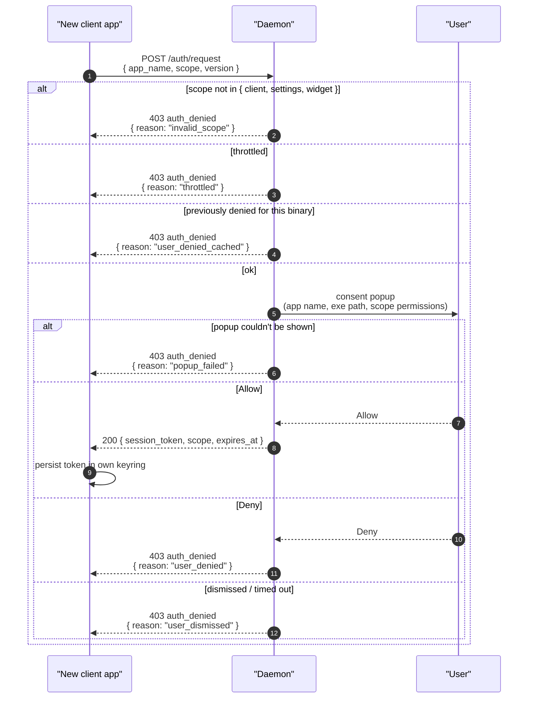

# Authentication

This document is the reference for everything a client needs to do
to obtain and use a session token. The three scopes
([client](./scopes/client.md), [settings](./scopes/settings.md), [widget](./scopes/widget.md))
share the same handshake and the same token format; only the
permission set they unlock differs. For HTTP framing and SSE
mechanics, see [transport.md](./transport.md).

## Why scopes

Auth on Super STT is consent-based: the user approves an app once,
under a stated scope, and that approval is bound to the binary the
user just saw — not to the app name the client claimed. A client
cannot widen its own permissions; it can only present a token that
was already approved for the scope it's using.

## The three scopes

| Scope        | What you can do with the token                                                            |
|--------------|-------------------------------------------------------------------------------------------|
| **client**   | Start / stop recording; receive your own preview text and final transcription              |
| **settings** | Everything in `client`, plus read/write every configuration value                          |
| **widget**   | Subscribe (read-only) to recording state, audio frames, optional transcription preview     |

A widget cannot mutate state. A `client`-scoped app cannot read or
change settings. A `settings`-scoped app inherits everything a
client can do.

## Endpoints

Authentication is **per-request**, not per-connection: every
request after the first carries the bearer token in an
`Authorization` header.

| Endpoint              | Method | What it does                                              |
|-----------------------|--------|-----------------------------------------------------------|
| `/auth/request`       | POST   | Trigger the consent popup; mint a fresh session token     |
| `/auth/status`        | GET    | Probe whether the bearer token is still valid (no UI)     |

`POST /auth/request` is the only endpoint that does not require an
existing token. Every other endpoint (including `/auth/status`)
requires `Authorization: Bearer <token>`.

### POST /auth/request

```http
POST /auth/request HTTP/1.1
Host: stt.local
Content-Type: application/json

{
  "app_name": "Super STT Settings App",
  "scope":    "settings",
  "version":  "0.10.0"
}
```

On approval:

```http
HTTP/1.1 200 OK
Content-Type: application/json

{
  "status":        "success",
  "session_token": "stt_…64hex…",
  "scope":         "settings",
  "expires_at":    "2026-06-04T12:34:56Z"
}
```

On any failure:

```http
HTTP/1.1 403 Forbidden
Content-Type: application/json

{
  "status":  "error",
  "message": "auth_denied",
  "data":    { "reason": "user_denied" }
}
```

| `data.reason`         | Meaning                                                                                          | What the client should do                                                                 |
|-----------------------|--------------------------------------------------------------------------------------------------|-------------------------------------------------------------------------------------------|
| `user_denied`         | The user clicked **Deny** in the consent popup.                                                  | Don't auto-retry. Offer an explicit "Retry authorization" affordance the user must click. |
| `user_denied_cached`  | The user previously denied this scope for this binary; the deny is sticky until the daemon restarts. | Same as `user_denied`. Hint that restarting the daemon (`systemctl --user restart super-stt`) clears the deny. |
| `user_dismissed`      | The user closed the popup without choosing, or it timed out (60 s default).                      | Recoverable — re-prompt when the user takes an action that requires it.                   |
| `popup_failed`        | The consent popup couldn't be shown (no display server, no Wayland session, etc.).               | Fall back to read-only mode if possible; surface a hint that a desktop session is needed. |
| `invalid_scope`       | The requested `scope` wasn't one of `client`, `settings`, `widget`.                              | Bug in the client. Fix the request.                                                       |
| `throttled`           | Too many `/auth/request` calls in a short window.                                                | Back off and retry later.                                                                 |
| `uid_mismatch`        | The peer's UID doesn't match the daemon's effective UID — the request came from a different user on the same machine. The daemon refuses cross-user consent flows regardless of socket group membership. | Run the requesting binary as the same user the daemon runs under (typically the desktop user).             |

### GET /auth/status

Probe whether the held token is still valid without spawning a
popup. Useful for headless / CLI clients that want to fail-fast.

```http
GET /auth/status HTTP/1.1
Host: stt.local
Authorization: Bearer stt_…64hex…
```

Valid:

```http
HTTP/1.1 200 OK
Content-Type: application/json

{
  "status":     "success",
  "scope":      "settings",
  "expires_at": "2026-06-04T12:34:56Z"
}
```

Invalid:

```http
HTTP/1.1 401 Unauthorized
Content-Type: application/json

{
  "status":  "error",
  "message": "invalid_session",
  "data":    { "reason": "expired" }
}
```

A positive response doesn't extend the expiry; a negative response
doesn't trigger consent — `/auth/status` is purely advisory.

## First-time handshake



The popup the user sees displays:

- **Application name** — declared by the app (untrusted; for UX only).
- **Executable path** — resolved from the peer's `/proc/<pid>/exe`
  (trusted; what the user actually approves against).
- **Scope and permissions** — a human-readable list of what the
  scope unlocks.

The token returned on Allow is a 32-byte random hex string
(`stt_…64hex…`). It carries no scope information by itself — the
scope is bound server-side at issue time and validated per request.

**Persist the token in a secure store** (your platform keyring,
libsecret/KWallet, the OS credential manager). Plaintext on disk
defeats the design — any other process running as the same user
can read it and impersonate the app.

## Per-request authorization

Every request after `/auth/request` carries:

```http
Authorization: Bearer <session_token>
```

Three failure modes return `401 invalid_session`:

```http
HTTP/1.1 401 Unauthorized
Content-Type: application/json

{
  "status":  "error",
  "message": "invalid_session",
  "data":    { "reason": "expired" }
}
```

| `data.reason`  | Why                                                                                                  | Client response                                                  |
|----------------|------------------------------------------------------------------------------------------------------|------------------------------------------------------------------|
| `unknown`      | Token isn't recognized — never issued, or revoked since.                                            | Drop your cached token and re-issue `POST /auth/request`.        |
| `expired`      | Token is older than its `expires_at` (30 days from issue).                                          | Same — drop and re-auth.                                         |
| `exe_changed`  | Your binary's path no longer matches what the user approved (upgrade, relocation, replacement).     | Same — re-auth. The user must consent again to the new binary.   |

A second class of failure is `403 scope_denied` — the token is
valid but doesn't have permission for this endpoint:

```http
HTTP/1.1 403 Forbidden
Content-Type: application/json

{
  "status":  "error",
  "message": "scope_denied"
}
```

This is a bug in the client (a `client`-scoped app trying to call
`POST /active_model`, for example). Re-issuing `/auth/request` with
a higher scope is the only path forward, and the user has to
explicitly approve the new scope.

There is no separate "resume" handshake. The next request a
returning app issues already validates the token; the app only has
to call `/auth/request` again when it sees `invalid_session`.

## Scope to endpoint mapping

Scope is checked before each endpoint runs. The reachable surface
breaks down into a small auth-owned set plus whatever the
per-scope docs define.

### Unauthenticated

No token required. This is the only way a new app can bootstrap.

| Endpoint               | Purpose                                         |
|------------------------|-------------------------------------------------|
| `POST /auth/request`   | Trigger the consent popup; mint a session token |

### Any authenticated token

Reachable with a valid `client`, `settings`, *or* `widget` token.
These endpoints leak no per-scope information.

| Endpoint            | Purpose                                          |
|---------------------|--------------------------------------------------|
| `GET /auth/status`  | Probe whether the held token is still valid      |
| `GET /ping`         | Liveness probe                                   |

### `client`, `settings`, `widget`

The per-scope endpoint reference for each lives in the dedicated
doc — those tables are the source of truth, not duplicated here:

- **`client` scope** — see [client.md](./scopes/client.md).
- **`settings` scope** — inherits everything in `client.md` and adds
  the configuration surface; see [settings.md](./scopes/settings.md).
- **`widget` scope** — read-only subscription to a restricted topic
  set on `GET /events`; see [widget.md](./scopes/widget.md).

Cross-scope access rules to remember:

- A `client` token cannot reach `settings`-scope endpoints; the
  daemon returns `403 scope_denied`.
- A `widget` token cannot reach anything outside its own scope (or
  the "any authenticated" set above); same `403 scope_denied`.
- A `settings` token satisfies `client` too, so it can drive
  recordings without a separate `client`-scoped session.
- Settings-only SSE topics (e.g. `daemon_status_changed`,
  `download_progress`) return `403 scope_denied` when requested by
  a widget token. See [widget.md](./scopes/widget.md) for the topic set
  widget tokens *are* allowed to request.

## Token characteristics

- **Shape:** 32-byte random value, hex-encoded, prefixed `stt_`.
- **Lifetime:** 30 days from issue (`expires_at` returned alongside
  the token).
- **Scope:** Bound at issue time. Use one token per scope; never
  share a token across apps.
- **Binding:** Tied to the binary's `/proc/<pid>/exe` at issue
  time. If that path changes (upgrade, move, replacement), the
  next request returns `401 invalid_session` with reason
  `exe_changed`, and the user must consent again.

## Behavior the client author should expect

A few non-obvious facts about how tokens behave on the wire:

- **Tokens survive daemon restarts.** Your cached token will still
  be valid after the daemon restarts, up to the 30-day expiry.
- **`/auth/request` always shows the popup.** There's no shortcut
  for "I had a token once, give me a fresh one without prompting."
  Cache the token client-side; only call `/auth/request` when you
  don't have a valid one.
- **Sticky deny clears on daemon restart.** If the user denied you
  and you want to offer a "retry after daemon restart" UX, hint
  that they need to actually restart the daemon — the daemon's
  deny memory does not persist across restarts.
- **Concurrent `/auth/request` calls from the same identity** each
  get their own popup, shown one at a time, and each yields its
  own session. This is rare; usually it just means you didn't
  serialize your own startup.

## TCP-bound clients

A future config flag lets the daemon bind a TCP listener with the
same HTTP API on `127.0.0.1:<port>`. The auth flow has a few
differences:

- The popup shows the **web origin** (`https://www.someapp.com`)
  instead of an executable path, since browsers don't expose peer
  credentials.
- Tokens are bound to `(app_name, web_origin)` instead of
  `(app_name, exe_path)`. Per-request validation re-checks the
  `Origin` header.
- The popup explicitly notes that web-origin identity is browser-
  enforced and not as strong as binary-path verification.

The wire shape (endpoints, headers, JSON bodies) is identical.

## Widget anti-replacement

The widget scope subscribes to a long-lived event stream that
carries audio frames and transcription text. If your binary's
identity changes mid-stream (upgrade in place, replaced on disk),
the stream ends with:

```
event: revoked
data: { "reason": "exe_changed" }
```

and the connection closes. The widget must re-issue
`/auth/request` (which triggers a fresh popup) before reopening
the subscription. For TCP-bound widget clients the same check
runs against the `Origin` header instead of `/proc/<pid>/exe`.

## Unauthenticated requests

A connection without a valid `Authorization` header can call
`POST /auth/request` and nothing else. Every other endpoint
returns `401 invalid_session` when the header is missing.
