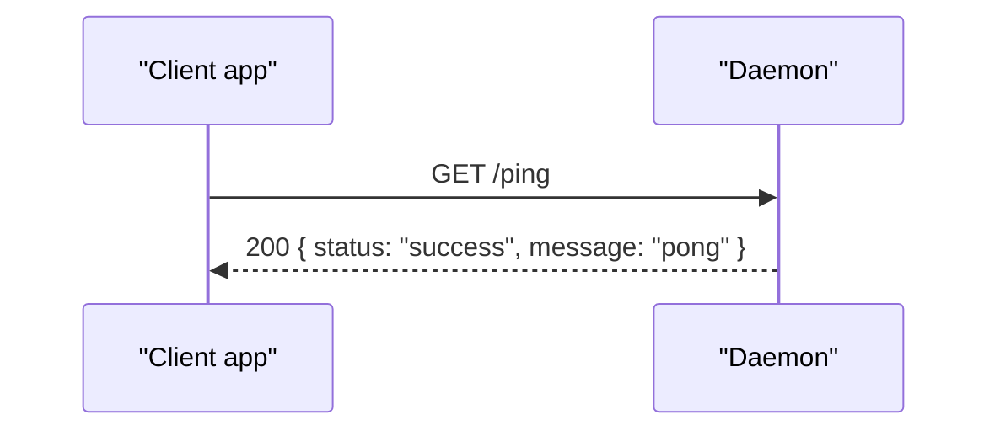
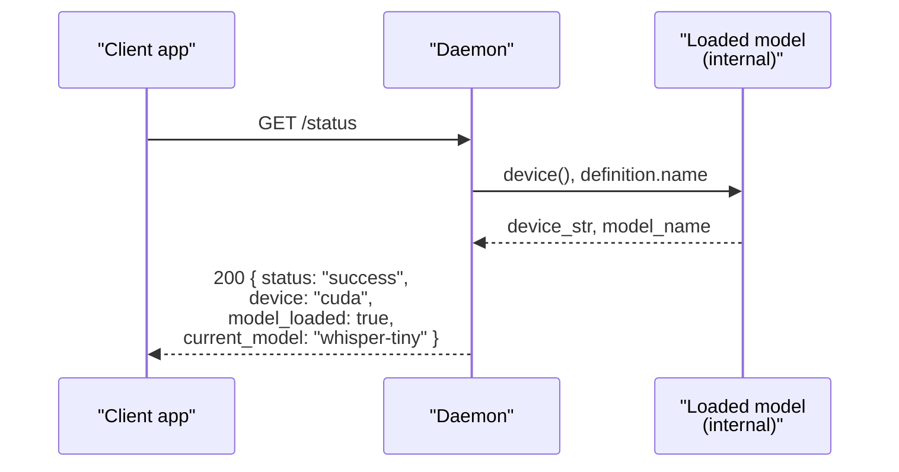
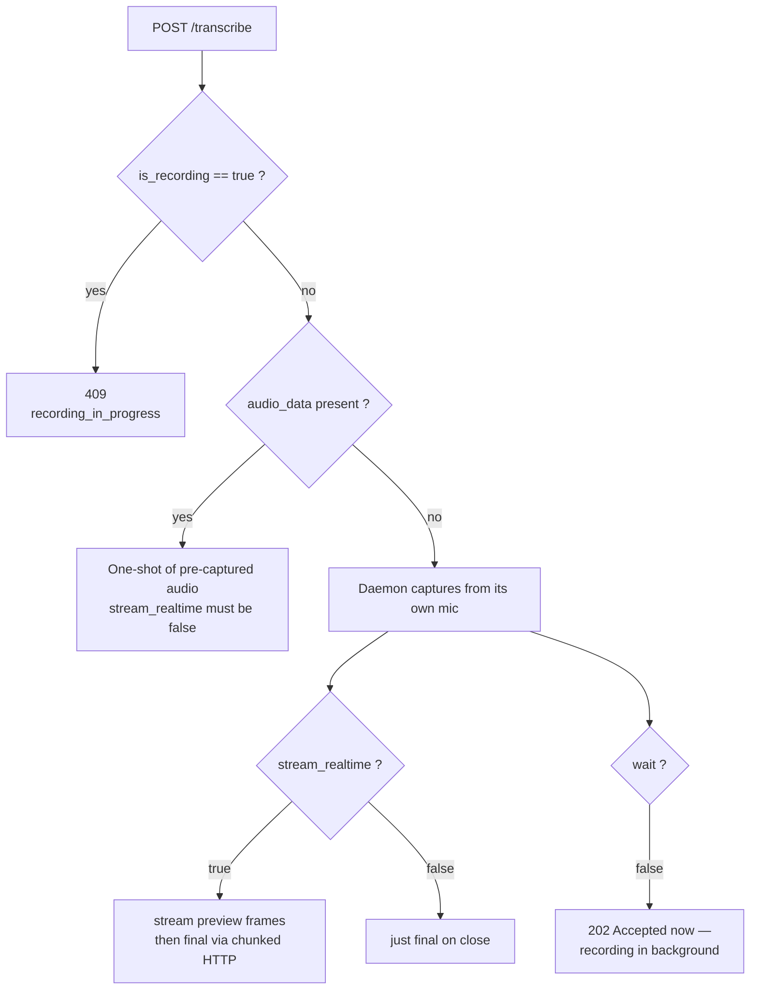
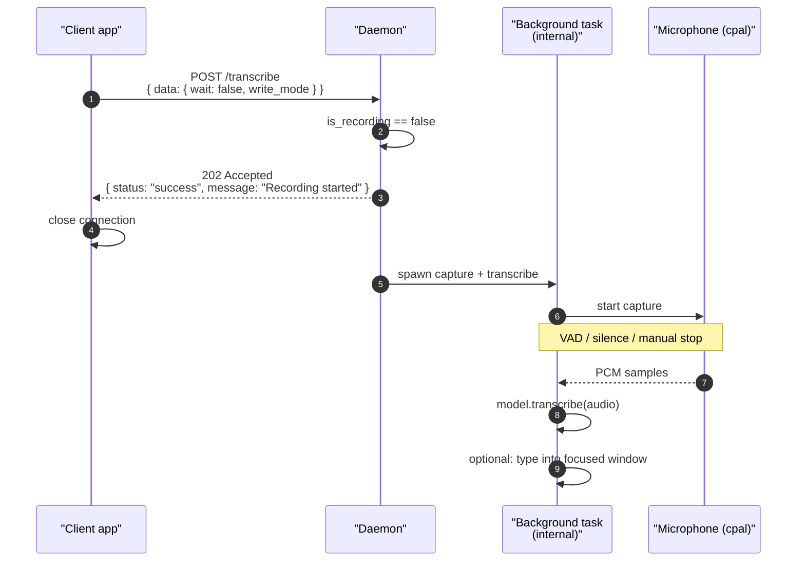
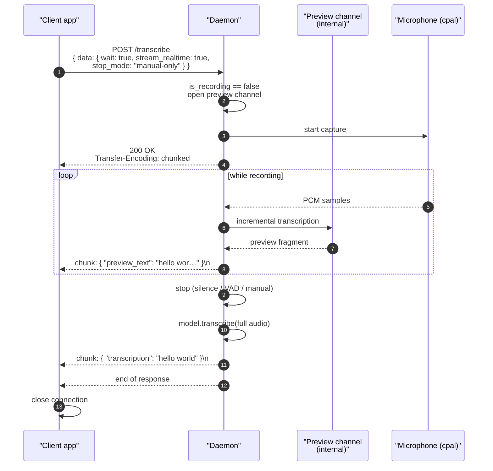
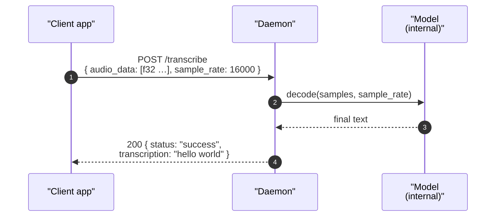
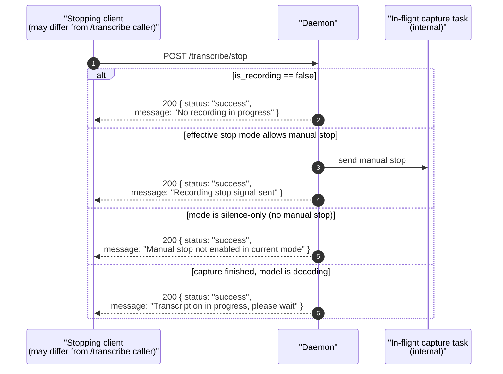
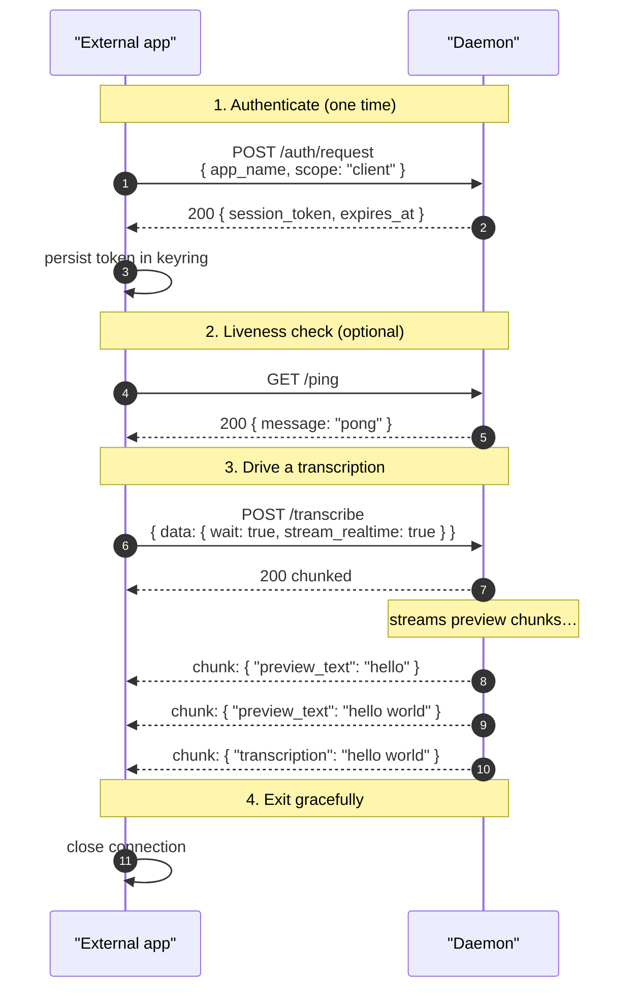

# Client Protocol

> Scope: **client** (read-only on configuration, full control over its own
> recording session).

The client protocol is the smallest scope. It can drive the microphone
through the daemon and read back transcription results from its own
sessions. It cannot read or modify any daemon configuration value, and it
cannot subscribe to other apps' transcriptions or to the audio fan-out
firehose.

> If you need configuration access, see [settings.md](./settings.md). If
> you only want to visualize audio or display global recording state, see
> [widget.md](./widget.md).

Authentication for this scope is shared with the others — see
[auth.md](./auth.md). After a successful handshake the daemon returns a
`session_token` that the app must attach as `Authorization: Bearer
<token>` on every subsequent HTTP request.

## Transport

All traffic is HTTP/1.1 over the Unix domain socket at
`$XDG_RUNTIME_DIR/stt/super-stt.sock`. See [transport.md](./transport.md)
for the full HTTP shape, framing, and example client code in several
languages.

## Endpoint index

| Endpoint                          | Method | Purpose                                                              |
|-----------------------------------|--------|----------------------------------------------------------------------|
| `/auth/request`                   | POST   | First-time consent (triggers popup) — see [auth.md](./auth.md)       |
| `/auth/status`                    | GET    | Probe whether the held token is still valid                          |
| `/ping`                           | GET    | Liveness check                                                       |
| `/status`                         | GET    | Current daemon state (model + device)                                |
| `/transcribe`                     | POST   | Start a transcription                                                |
| `/transcribe/stop`                | POST   | Stop an in-flight daemon-mic capture early                           |

That's the entire client-scope surface. Recording, real-time streaming
preview, and one-shot transcription of pre-captured audio are all the
same endpoint: `POST /transcribe`, dispatched on its options. Stopping
an in-flight daemon-mic capture is a separate endpoint
(`POST /transcribe/stop`) rather than a `transcribe` toggle. There are
no separate `subscribe` / `unsubscribe` / event-replay primitives —
preview frames and the final result come back on the same HTTP
response (chunked) the `/transcribe` request initiated.

---

## `POST /auth/request` / `GET /auth/status`

See [auth.md](./auth.md) for the full handshake. `/auth/request` is the
only endpoint that triggers the libcosmic consent popup; `/auth/status`
is a no-side-effect probe of the token currently held by the client.

Every other endpoint in this document carries `Authorization: Bearer
<token>`. The token is validated on every call; on a `401
invalid_session` the client must re-issue `/auth/request`. To keep
the diagrams readable, the per-request `Authorization` header is
omitted below — assume it's present on every HTTP request shown.

---

## `GET /ping`

Round-trip a "pong" to verify the daemon is alive and reachable. Pure
liveness — no session introspection.



**Response:** `{ "status": "success", "message": "pong" }`.

To check whether the held token is still valid, use `/auth/status`
(see [auth.md](./auth.md)) — that's the dedicated probe.

---

## `GET /status`

Returns the daemon's current operational state: the loaded model and
the device it's running on. **Subscriber introspection is not exposed
to the client scope** — that lives in `settings`.



**Response:** `{ "status": "success", "device", "model_loaded",
"current_model" }`.

---

## `POST /transcribe`

Starts a transcription. `POST /transcribe` covers four concrete use
cases, dispatched on its body options:

| Use case                                  | `audio_data`        | `stream_realtime` | `wait`         |
|-------------------------------------------|---------------------|-------------------|----------------|
| Daemon-mic, fire-and-forget               | absent              | (ignored)         | `false`        |
| Daemon-mic, hold socket for final result  | absent              | `false`           | `true`         |
| Daemon-mic, stream preview + final        | absent              | `true`            | `true`         |
| Pre-captured audio (one-shot)             | `[f32]` present     | (n/a — must be `false` or absent) | `true` (impl.) |

`stream_realtime` only applies to the daemon-mic capture path, where new
audio arrives over time and the model can decode partial buffers as they
fill. With `audio_data` the full waveform is already in hand; there are
no incremental frames to emit. Combining `audio_data` with
`stream_realtime: true` is rejected with `400 stream_realtime_with_audio_data`.

`POST /transcribe` never doubles as a stop signal — issuing it while a
daemon-mic capture is already in progress returns `409
recording_in_progress`. To end an in-flight capture early, use
[`POST /transcribe/stop`](#post-transcribestop).

The daemon decides which path it's on by inspecting the request body:



### Request body

```jsonc
{
  // Optional. Present = pre-captured audio, daemon will not touch the mic.
  // Absent = daemon captures from its own microphone.
  "audio_data":    [0.012, -0.034, …],
  "sample_rate":   16000,

  // Hint for the model (when supported by the loaded model).
  "language":      "en",

  "data": {
    // Stream incremental preview_text frames before the final transcription.
    // Default: false.
    "stream_realtime": true,

    // Mic-capture options (ignored when audio_data is present).
    // Default false. When true the daemon types the final transcription
    // into the focused window via the configured WriteMethod.
    "write_mode":      false,
    // Per-request override for the configured stop mode. One of:
    //   "silence" | "silence-and-manual" | "manual-only"
    "stop_mode":       "manual-only",
    // Default false. true = hold the response open until the final result.
    "wait":            true,
    // Per-request override for the preview_typing config flag.
    "preview":         true
  }
}
```

`audio_data` and `sample_rate` live at the request body's top level
(matching the `DaemonRequest` shape). The mic-capture knobs and
`stream_realtime` live under `data` because they're command-specific.

### Daemon-mic, fire-and-forget

`audio_data` absent, `wait: false`. Daemon ACKs immediately with `202
Accepted` and runs the recording + transcription in a background task.
If `write_mode: true`, the final transcription is typed into the
focused window. The caller closes the connection after the ACK.



### Daemon-mic, wait + stream preview

`audio_data` absent, `wait: true`, `stream_realtime: true`. The daemon
holds the HTTP response open and writes any number of `preview_text`
chunks as the recording progresses, then a final chunk with
`transcription`. The response uses `Transfer-Encoding: chunked` and
each line is a JSON object terminated by `\n`.



If `stream_realtime: false` and `wait: true`, the daemon emits no
preview chunks and just sends a single final response body when
recording completes (no chunked encoding needed).

### Pre-captured audio (one-shot)

`audio_data` present. Daemon ignores its mic, runs the model over the
buffer in one pass, returns the final transcription. There is no
streaming preview path — the full waveform is already known when the
request arrives, so the model decodes it as a single unit.



This is the simplest way to verify the loaded model end-to-end: feed a
short clip of f32 PCM samples, expect text back.

### Stopping early via socket disconnect

For any `POST /transcribe` issued with `wait: true`, **closing the HTTP
connection acts as an implicit stop signal**. The daemon detects the
disconnect on its next chunk write and treats it the same as a manual
stop — it ends the capture and discards whatever output was about to
be sent. This is the recommended way for a same-process client to
cancel its own in-flight recording.

The implicit stop only applies to the daemon-mic capture path. A
pre-captured (`audio_data`) request is processed in a single decode
pass; closing the connection mid-decode just means the daemon throws
away the result it was about to write. There is nothing to "stop".

For the `wait: false` (fire-and-forget) path the connection is closed
by design *immediately after* the daemon's `202 Accepted`. That close
is not a stop signal — the recording is meant to keep running in the
background. To end a fire-and-forget recording early, use
[`POST /transcribe/stop`](#post-transcribestop).

### Response shape summary

| Path                                | Response                                                                |
|-------------------------------------|-------------------------------------------------------------------------|
| Daemon-mic, `wait: false`           | `202` with `{ "message": "Recording started" }`                          |
| Daemon-mic, `wait: true`, no stream | `200` with `{ "transcription": "..." }` once recording finishes          |
| Daemon-mic, `wait: true`, streaming | `200 chunked`: zero or more `{ "preview_text": "..." }` lines, then a final `{ "transcription": "..." }` line |
| Pre-captured (`audio_data`)         | `200` with `{ "transcription": "..." }`                                  |
| Error                               | `4xx` / `5xx` with `{ "status": "error", "message", "data" }`            |

`stop_mode` and `preview` are per-request overrides for the
configured defaults — those defaults are owned by the
[settings scope](./settings.md).

---

## `POST /transcribe/stop`

> **Most apps don't need this endpoint.** If your `/transcribe`
> connection is still open (`wait: true`), just close the HTTP
> connection — the daemon treats client disconnect as an implicit stop.
> `/transcribe/stop` only exists for the two cases where socket-close
> isn't available.

Use `/transcribe/stop` when:

1. **You sent `/transcribe` with `wait: false`.** The connection is
   already closed by design (fire-and-forget). The recording is running
   in the background and the only way to end it early is a fresh
   request.
2. **You're stopping a recording started by a different process.** A
   panel applet, a hotkey daemon, or a second invocation of your CLI
   wants to stop a recording it didn't start. You can't close a
   connection you don't own.

Otherwise: prefer disconnecting your `/transcribe` HTTP connection.
It's simpler, atomic with whatever else your client is doing, and
doesn't require a second round-trip on the wire.

`/transcribe/stop` only applies to the daemon-mic capture path. The
pre-captured (`audio_data`) path is one-shot and synchronous — there's
nothing to stop.



`/transcribe/stop` is idempotent: calling it when nothing is running,
or twice in quick succession, returns success with an informational
message rather than an error.

This endpoint **does not affect** the connection that issued the
matching `/transcribe`. If that caller used `wait: true`, it continues
to read preview chunks and the final `transcription` response on its
own connection — `/transcribe/stop` simply causes the capture to end
sooner. It is the daemon, not the stopping client, that delivers the
final result to whoever asked for it.

**Response:** `{ "status": "success", "message": "..." }`.

---

## Errors

Every error returns a JSON body with `status: "error"` and a stable
`message` identifier. The HTTP status code mirrors the error class:

| HTTP | `message`                          | Meaning                                                                 |
|------|------------------------------------|-------------------------------------------------------------------------|
| 401  | `invalid_session`                  | Token unknown / expired / exe path changed — re-issue `/auth/request`   |
| 403  | `scope_denied`                     | This scope can't run that endpoint (e.g. `/active_model`)           |
| 409  | `recording_in_progress`            | `/transcribe` issued while a daemon-mic capture was already running     |
| 409  | `manual_stop_not_enabled`          | `/transcribe/stop` while configured mode is `silence-only`              |
| 400  | `stream_realtime_with_audio_data`  | `/transcribe` carried both `audio_data` and `stream_realtime: true`     |
| 429  | `rate_limited`                     | Per-client rate limit hit; back off and retry                           |
| 503  | `connection_rejected`              | Daemon's resource manager refused the connection                        |

Error messages on the wire are sanitized to one short line; full
context lives in the daemon logs. Set `SUPER_STT_DEBUG_ERRORS=1` in
the daemon environment to disable that while developing.

---

## A typical client session

The simplest end-to-end flow for a non-Rust client (curl-ish):



For Rust clients, `super_stt_shared::daemon::client` will wrap this
sequence into typed function calls under the new HTTP transport.
