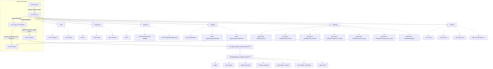

# Daemon Protocol

```mermaid
graph TD
    subgraph Daemon ["super-stt Daemon"]
        D_Auth[Auth Service]
        D_API[HTTP API /v1]
        D_SSE[Event Stream]
        D_DBus[D-Bus Interface]
        D_Core[Core Logic / ML Pipeline]
    end

    %% Authentication Flow
    D_Auth -- "Consent Popup / Token" --> D_API

    %% Command Flow
    D_API -- "DaemonRequest" --> D_Core
    D_Core -- "DaemonResponse" --> D_API

    %% Event Flow
    D_Core -- "Events (Recording, STT, Progress)" --> D_SSE
    D_Core -- "Signals (Listening, Audio Level)" --> D_DBus

    %% HTTP Route Groups
    D_API --> R_Auth["/auth"]
    D_API --> R_Transcribe["/transcribe"]
    D_API --> R_Pipeline["/pipeline"]
    D_API --> R_Registry["/registry"]
    D_API --> R_Settings["/settings"]
    D_API --> R_System["/system"]

    %% Auth Endpoints
    R_Auth -.-> E1["POST /request"]
    R_Auth -.-> E2["GET /status"]

    %% Transcribe Endpoints
    R_Transcribe -.-> E3["POST /"]
    R_Transcribe -.-> E4["POST /stop"]
    R_Transcribe -.-> E5["GET /realtime"]

    %% Pipeline Endpoints
    R_Pipeline -.-> E6["GET /"]
    R_Pipeline -.-> E7["GET/POST/DELETE /{stage}"]
    R_Pipeline -.-> E8["POST /{stage}/model/reload"]

    %% Registry Endpoints
    R_Registry -.-> E9["GET /backend/list"]
    R_Registry -.-> E10["POST /registry/backend/install"]
    R_Registry -.-> E11["POST /registry/backend/refresh"]

    %% Settings Endpoints
    R_Settings -.-> E12["GET/POST /settings/volume"]
    R_Settings -.-> E13["GET/POST /settings/audio_theme"]
    R_Settings -.-> E14["GET/POST /settings/write_method"]
    R_Settings -.-> E15["GET/POST /settings/notification_method"]
    R_Settings -.-> E16["GET/POST /settings/preview_typing"]
    R_Settings -.-> E17["GET/POST /settings/recording_stop_mode"]
    R_Settings -.-> E18["GET/POST /settings/language"]

    %% System Endpoints
    R_System -.-> E19["GET /ping"]
    R_System -.-> E20["GET /status"]
    R_System -.-> E21["GET /gpu_info"]
    R_System -.-> E22["GET /events?topics=..."]
    E22 --> D_SSE

    %% D-Bus Interface
    D_DBus --> DB_Int["com.github.jorge_menjivar.SuperSTT1"]
    DB_Int --> DB_Obj["/com/github/jorge_menjivar/SuperSTT"]
    DB_Obj -.-> DB_M1["ping()"]
    DB_Obj -.-> DB_M2["get_status()"]
    DB_Obj -.-> DB_S1["listening_started"]
    DB_Obj -.-> DB_S2["listening_stopped"]
    DB_Obj -.-> DB_S3["transcription_started"]
    DB_Obj -.-> DB_S4["transcription_completed"]
    DB_Obj -.-> DB_S5["audio_level"]
```
