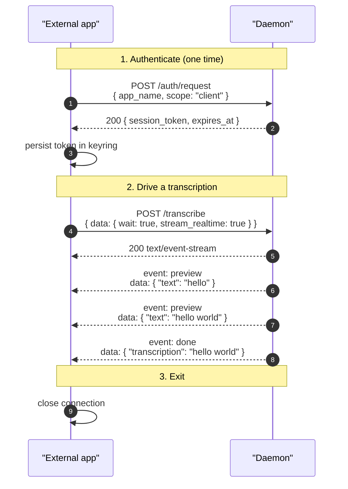

# Client scope

> Scope: **client** (drive the microphone through the daemon and
> read back transcription results from its own sessions; no access
> to configuration or to other apps' transcriptions).

The client scope is the smallest. It cannot read or modify any
daemon configuration value and cannot subscribe to other apps'
transcriptions or to the audio fan-out firehose.

> If you need configuration access, see [settings.md](./settings.md).
> If you only want to visualize audio or display global recording
> state, see [widget.md](./widget.md). Authentication is shared
> across all three scopes — see [auth.md](../auth.md).

All traffic is HTTP/1.1 over the Unix domain socket at
`$XDG_RUNTIME_DIR/stt/super-stt-http.sock`. See
[transport.md](../transport.md) for the wire-level details (HTTP
framing, SSE mechanics, example client code in several languages).

## Endpoint reference

| Endpoint                                            | Methods    | Notes                                                                  |
|-----------------------------------------------------|------------|------------------------------------------------------------------------|
| [`/auth/request`](../endpoints/v1/auth/request.md)  | POST       | First-time consent (triggers popup) — see [auth.md](../auth.md)        |
| [`/auth/status`](../endpoints/v1/auth/status.md)    | GET        | Probe whether the held token is still valid                            |
| [`/ping`](../endpoints/v1/ping.md)                  | GET        | Liveness check (any authenticated scope, not just `client`)            |
| [`/status`](../endpoints/v1/status.md)              | GET        | Current daemon state (model + device)                                  |
| [`/transcribe`](../endpoints/v1/transcribe.md)      | POST       | Start a transcription                                                  |
| [`/transcribe/stop`](../endpoints/v1/transcribe/stop.md) | POST  | Stop an in-flight daemon-mic capture                                   |

`/ping` is the only entry in the table any valid token — client,
settings, *or* widget — can call. The other endpoints listed
require a client (or settings) token.

## The four `/transcribe` modes

A single endpoint covers four use cases, dispatched on the body.
The full request body, response shape, and error table are on
[`/transcribe`](../endpoints/v1/transcribe.md); the quick map:

| Use case                                  | `audio_data`    | `stream_realtime` | `wait`         | Response                                                  |
|-------------------------------------------|-----------------|-------------------|----------------|-----------------------------------------------------------|
| Daemon-mic, fire-and-forget               | absent          | (ignored)         | `false`        | `202` + `{ message: "Recording started" }`                |
| Daemon-mic, wait for final                | absent          | `false`           | `true`         | `200 text/event-stream` with a single `event: done`       |
| Daemon-mic, stream preview + final        | absent          | `true`            | `true`         | `200 text/event-stream` with `event: preview` then `event: done` |
| Pre-captured audio (one-shot)             | `[f32]` present | (must be `false`) | (implicit)     | `200` JSON with `{ "transcription": "..." }`              |

`POST /transcribe` never doubles as a stop signal — issuing it
while a daemon-mic capture is already running returns
`409 recording_in_progress`. To implement toggle behavior, consult
`is_recording` on [`GET /status`](../endpoints/v1/status.md) and
route to [`POST /transcribe/stop`](../endpoints/v1/transcribe/stop.md)
when a capture is in progress. The `super-stt` CLI's `record`
subcommand does exactly this.

## A typical client session

The end-to-end shape for a non-Rust client driving one recording.
The handshake at step 1 only runs the *first* time; cached tokens
go straight to step 2.

On any `401 invalid_session` the cached token is dead — re-run step
1 and retry.
