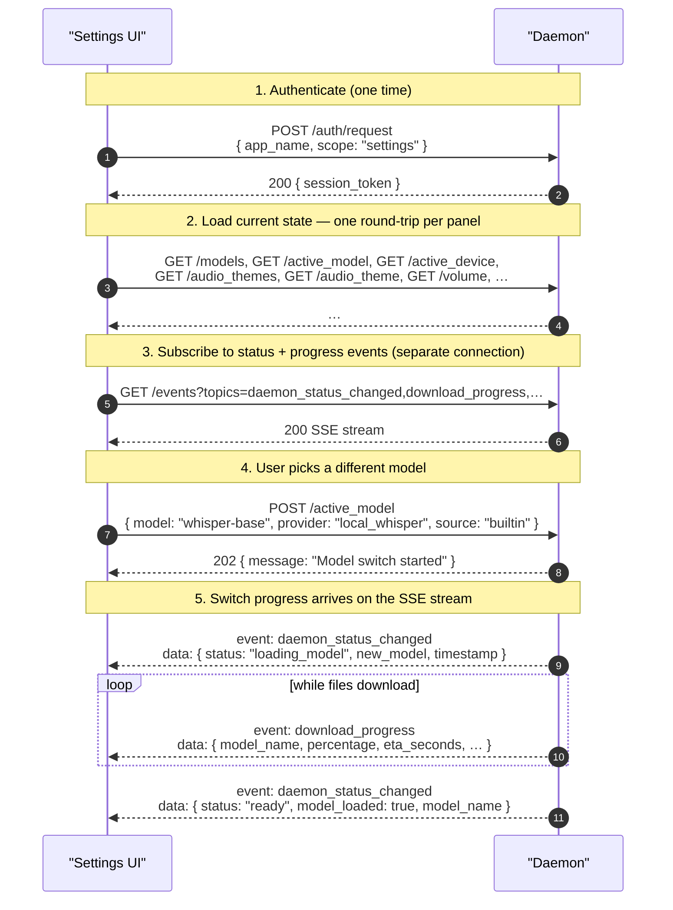

# Settings scope

> Scope: **settings** (full read/write access to daemon
> configuration, plus everything in [client](./client.md)).

The settings scope is the highest-trust scope. A `settings` token
can do anything in the [client protocol](./client.md) and can
additionally read every daemon configuration value, change any of
them, and persist the change to disk.

> Use `client` if you only need to drive recordings; use
> [`widget`](./widget.md) if you only need to visualize state. The
> `settings` scope is for the actual Settings UI and CLI tools that
> manage the daemon. Authentication is shared across all three
> scopes — see [auth.md](../auth.md).

Transport and framing are identical to the client scope; see
[transport.md](../transport.md) for the HTTP-level details.

## What gets mirrored on `/events`

Settings mutations have **two** observable wire effects: the HTTP
response on the request that made them, and (for model/device
transitions) follow-up SSE events on any `GET /events` subscription
that asked for `daemon_status_changed` or `download_progress`.

| Mutation                                                                                                                          | Mirrored as an SSE event?                                                                                  |
|-----------------------------------------------------------------------------------------------------------------------------------|------------------------------------------------------------------------------------------------------------|
| `/active_model`, `/active_device`, `/allow_online_models` (when it triggers a fallback)                                          | Yes — `daemon_status_changed` (and `download_progress` while files are being pulled)                       |
| `/audio_theme`, `/volume`, `/write_method`, `/recording_stop_mode`, `/preview_typing`, `/allow_online_models` (no fallback), `/custom_models_dir` | No. Clients that want to see *another* app change one of these must re-`GET` the relevant endpoint.        |

## Endpoint reference

The first group is shared with the [client scope](./client.md);
the rest is settings-only.

### Shared with client

| Endpoint                                                | Methods    | Notes                                                                  |
|---------------------------------------------------------|------------|------------------------------------------------------------------------|
| [`/auth/request`](../endpoints/v1/auth/request.md)      | POST       | First-time consent — see [auth.md](../auth.md)                         |
| [`/auth/status`](../endpoints/v1/auth/status.md)        | GET        | Probe whether the held token is still valid                            |
| [`/ping`](../endpoints/v1/ping.md)                      | GET        | Liveness check                                                          |
| [`/status`](../endpoints/v1/status.md)                  | GET        | Current daemon state (model + device)                                   |
| [`/transcribe`](../endpoints/v1/transcribe.md)          | POST       | Start a transcription                                                   |
| [`/transcribe/stop`](../endpoints/v1/transcribe/stop.md)| POST       | Stop an in-flight daemon-mic capture                                    |

### Settings-only

| Endpoint                                                    | Methods    | Notes                                                                                                |
|-------------------------------------------------------------|------------|------------------------------------------------------------------------------------------------------|
| [`/active_model`](../endpoints/v1/active_model.md)          | POST, GET  | Switch the active STT model and read its current state + any in-flight switch                        |
| [`/active_model/cancel`](../endpoints/v1/active_model/cancel.md) | POST  | Abort an in-flight model switch                                                                       |
| [`/models`](../endpoints/v1/models.md)                      | GET        | List built-in + custom models                                                                         |
| [`/active_device`](../endpoints/v1/active_device.md)        | POST, GET  | Switch CPU vs CUDA; read current device + GPU memory                                                  |
| [`/audio_theme`](../endpoints/v1/audio_theme.md)            | POST, GET  | Set / read the audio cue theme                                                                        |
| [`/audio_theme/test`](../endpoints/v1/audio_theme/test.md)  | POST       | Audition the current theme's start + stop cues                                                        |
| [`/audio_themes`](../endpoints/v1/audio_themes.md)          | GET        | List available themes                                                                                  |
| [`/volume`](../endpoints/v1/volume.md)                      | POST, GET  | Set / read audio cue volume (0–100)                                                                   |
| [`/recording_stop_mode`](../endpoints/v1/recording_stop_mode.md) | POST, GET | Default stop behavior for `/transcribe` (silence / silence-and-manual / manual-only)                  |
| [`/preview_typing`](../endpoints/v1/preview_typing.md)      | POST, GET  | Toggle live typing of preview text while recording                                                    |
| [`/write_method`](../endpoints/v1/write_method.md)          | POST, GET  | Keyboard simulation method (auto / xdg-desktop-portal / ydotool / wayland-protocol)                   |
| [`/allow_online_models`](../endpoints/v1/allow_online_models.md) | POST, GET | Privacy gate for online providers (OpenAI / Mistral / Deepgram)                                       |
| [`/custom_models_dir`](../endpoints/v1/custom_models_dir.md) | POST, GET | Where to scan for user-supplied models                                                                |
| [`/events`](../endpoints/v1/events.md)                      | GET (SSE)  | Subscribe to every published topic (no widget-scope restrictions)                                     |

## Subscribable topics

The full topic table and payload shapes live on
[`/events`](../endpoints/v1/events.md). The quick summary:

| Topic                       | Scope          | Carries                                                                        |
|-----------------------------|----------------|--------------------------------------------------------------------------------|
| `recording_started`         | widget / settings | `{ client_id, timestamp, write_mode }`                                       |
| `recording_stopped`         | widget / settings | `{ client_id, timestamp, transcription_success, error }`                     |
| `recording_state`           | widget / settings | `{ is_recording: bool }`                                                     |
| `audio_samples`             | widget / settings | base64-encoded f32 PCM                                                       |
| `frequency_bands`           | widget / settings | base64-encoded f32 visualization bands                                       |
| `partial_stt` / `final_stt` | widget / settings | `{ text, confidence }`                                                       |
| `daemon_status_changed`     | **settings only**  | model / device transition status                                            |
| `download_progress`         | **settings only**  | model-download tick                                                          |

## A typical settings session

A settings UI usually opens two HTTP connections in parallel:
one-shot connections for each read or write, plus a long-lived SSE
connection for `/events`. The SSE channel carries running
model-switch progress so the UI's progress bar updates without
polling.

Settings mutations that aren't mirrored on `/events` (the
non-model row of the table at the top) won't trigger SSE events;
a settings UI that wants to detect another app changing those needs
to re-`GET` the relevant endpoint.
