# Settings Protocol

> Scope: **settings** (full read/write access to daemon configuration, plus
> everything in [client](./client.md)).

The settings protocol is the highest-trust scope. An app holding a
`settings` session token can do anything in the [client protocol](./client.md)
and can additionally read every daemon configuration value, change any
of them, and persist the change to disk.

> Use `client` if you only need to drive recordings; use `widget` if you
> only need to visualize state. The `settings` scope is for the actual
> Settings UI and CLI tools that manage the daemon.

Authentication, transport, framing, and the request/response wire shape
are identical to the client protocol — see [client.md](./client.md) for
the basics, [auth.md](./auth.md) for the handshake, and
[transport.md](./transport.md) for HTTP details. This document only
covers the additional endpoints available to this scope.

## Configuration source of truth

Every settings mutation writes through to the same on-disk config file
that the daemon loads at startup. The daemon also publishes a
`config_changed` event on `GET /events` after each write so other
interested clients can react.

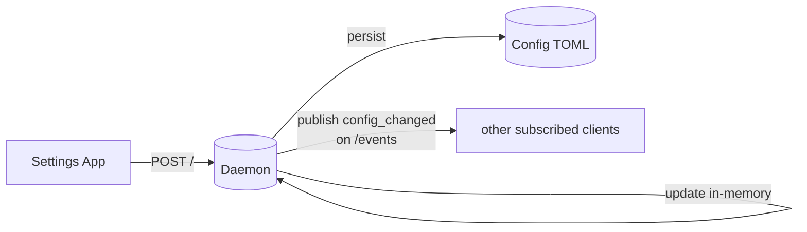
```mermaid
flowchart LR
    s[Settings App]
    d[(Daemon)]
    cfg[(Config TOML)]
    sub[other subscribed clients]

    s -- "POST /<resource>" --> d
    d -- "update in-memory" --> d
    d -- "persist" --> cfg
    d -- "publish config_changed<br/>on /events" --> sub
```

The component that holds the per-topic subscriber list lives inside the
daemon process — it isn't a separate service or socket peer.

## Endpoint index (settings-only)

The settings scope inherits every endpoint listed in [client.md](./client.md)
and adds:

| Endpoint                                 | Method | Purpose                                                |
|------------------------------------------|--------|--------------------------------------------------------|
| `/active_model`                      | POST   | Start switching the active STT model (asynchronous)    |
| `/models`                           | GET    | List built-in + custom models                          |
| `/active_model`                   | GET    | Comprehensive status of the active model: what's loaded, on which device, plus any in-flight switch |
| `/active_model/cancel`               | POST   | Abort an in-flight model switch                        |
| `/active_device`                     | POST   | Switch CPU vs CUDA                                     |
| `/active_device`                     | GET    | Read current device + free GPU memory                  |
| `/audio_theme`                       | POST   | Set audio cue theme                                    |
| `/audio_theme`                       | GET    | Read current audio theme                               |
| `/audio_theme/test`                      | POST   | Play the current theme's start/stop cues               |
| `/audio_themes`                     | GET    | List available themes                                  |
| `/volume`                            | POST   | Set audio cue volume (0–100)                            |
| `/volume`                            | GET    | Read current volume                                    |
| `/recording_stop_mode`               | POST   | silence / silence-and-manual / manual                   |
| `/recording_stop_mode`               | GET    | Read current stop mode                                  |
| `/write_method`                      | POST   | auto / xdg-desktop-portal / ydotool / wayland-protocol |
| `/write_method`                      | GET    | Read current write method                              |
| `/preview_typing`                    | POST   | Live typing while recording                            |
| `/preview_typing`                    | GET    | Read preview-typing flag                               |
| `/allow_online_models`               | POST   | Privacy gate for OpenAI/Mistral/Deepgram                |
| `/allow_online_models`               | GET    | Read online-models flag                                 |
| `/custom_models_dir`                 | POST   | Where to scan for user-supplied models                  |
| `/custom_models_dir`                 | GET    | Read the configured directory                           |
| `/events`                                | GET (SSE) | Subscribe to cross-app state-change events           |

Each is documented below with a mermaid diagram.

---

## `POST /active_model` / `GET /models`

The active STT model is identified by a `(name, provider, source)` triple:

- **name** — the model's unique identifier (`whisper-tiny`, `voxtral-mini-latest`, …).
- **provider** — `local_whisper`, `local_voxtral`, or one of the online
  providers (`openai`, `mistral`, `deepgram`).
- **source** — `builtin` (registry-defined), `custom` (loaded from
  `custom_models_dir`), or `online`.

`POST /active_model` is intentionally explicit about its cost: it can
take seconds (or longer) when files have to be downloaded or a large
model loaded onto a GPU. The daemon dispatches the switch as a
background operation and returns `202 Accepted` immediately; both the
post-load result and the in-flight progress are observed via
[`GET /active_model`](#get-active_model--post-active_modelcancel) or
by listening for `model_switch_*` events on
[`GET /events`](#get-events-sse).

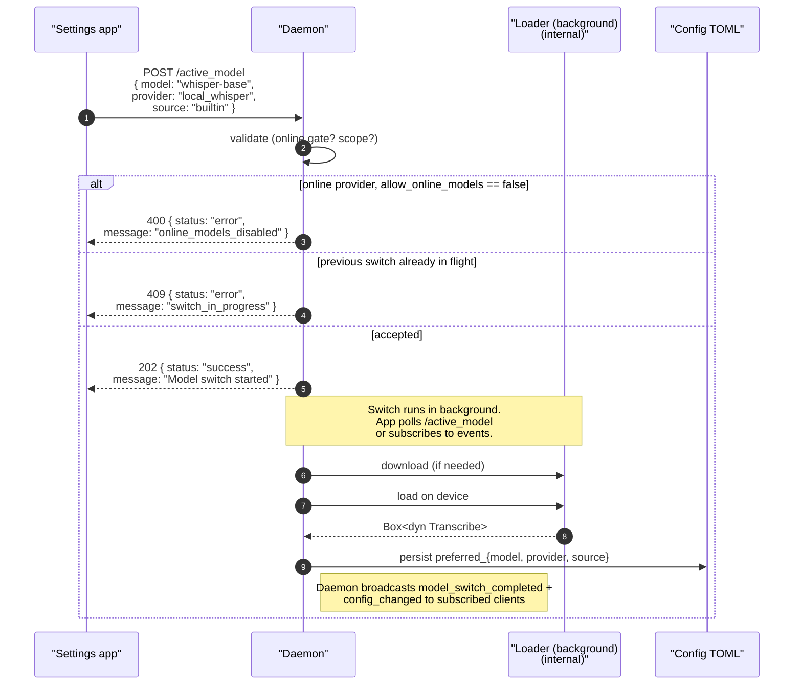
```mermaid
sequenceDiagram
    autonumber
    participant App as "Settings app"
    participant D as "Daemon"
    participant L as "Loader (background)<br/>(internal)"
    participant Cfg as "Config TOML"

    App->>D: POST /active_model<br/>{ model: "whisper-base",<br/>  provider: "local_whisper",<br/>  source: "builtin" }
    D->>D: validate (online gate? scope?)
    alt online provider, allow_online_models == false
        D-->>App: 400 { status: "error",<br/>           message: "online_models_disabled" }
    else previous switch already in flight
        D-->>App: 409 { status: "error",<br/>           message: "switch_in_progress" }
    else accepted
        D-->>App: 202 { status: "success",<br/>           message: "Model switch started" }
        Note over D,L: Switch runs in background.<br/>App polls /active_model<br/>or subscribes to events.
        D->>L: download (if needed)
        D->>L: load on device
        L-->>D: Box<dyn Transcribe>
        D->>Cfg: persist preferred_{model, provider, source}
        Note right of D: Daemon broadcasts model_switch_completed +<br/>config_changed to subscribed clients
    end
```

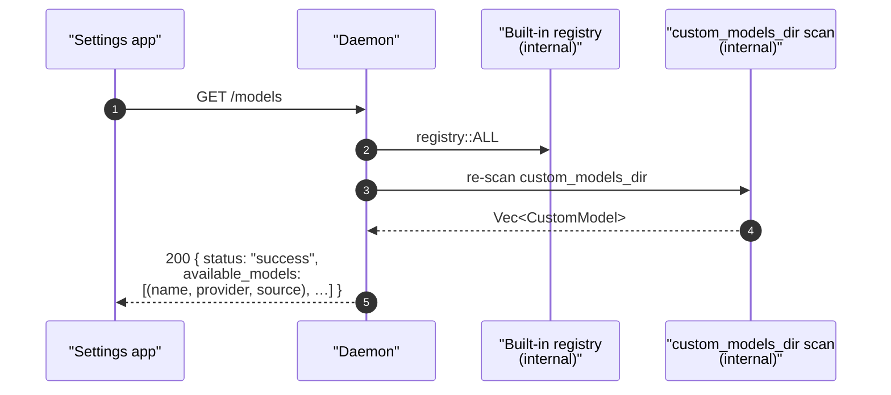
```mermaid
sequenceDiagram
    autonumber
    participant App as "Settings app"
    participant D as "Daemon"
    participant R as "Built-in registry<br/>(internal)"
    participant C as "custom_models_dir scan<br/>(internal)"

    App->>D: GET /models
    D->>R: registry::ALL
    D->>C: re-scan custom_models_dir
    C-->>D: Vec<CustomModel>
    D-->>App: 200 { status: "success",<br/>           available_models:<br/>             [(name, provider, source), …] }
```

**Request body (`POST /active_model`):** `{ "model", "provider",
"source" }` (the last is optional; defaults derived from provider).

**Response (`POST /active_model`):** `202 Accepted` with
`{ "status": "success", "message": "Model switch started" }` confirming
the switch was *queued*. The actual model identity, load state, and
in-flight switch progress all come back through `/active_model`
once the load completes (or while it's running).

`GET /active_model` covers both the at-rest "what's currently loaded"
question and the in-flight "where is the switch?" question — there is
no separate read-only endpoint.

---

## `GET /active_model` / `POST /active_model/cancel`

`/active_model` is the **single endpoint** a settings UI needs
to render the entire "Model" section: which model is currently loaded,
which device it's on, and (if a switch is running) where the switch
is in its lifecycle. The response is structured so the same payload
covers the at-rest and in-flight cases — clients don't need to combine
multiple endpoints to draw the model panel.

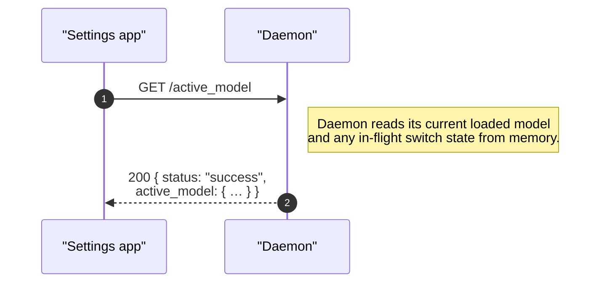
```mermaid
sequenceDiagram
    autonumber
    participant App as "Settings app"
    participant D as "Daemon"

    App->>D: GET /active_model
    Note right of D: Daemon reads its current loaded model<br/>and any in-flight switch state from memory.
    D-->>App: 200 { status: "success",<br/>           active_model: { … } }
```

### Response payload

```jsonc
{
  "status": "success",
  "active_model": {

    // Always present — what's currently active right now.
    // Reflects the previously-loaded model while a switch is in flight,
    // and the new model once that switch reaches phase=ready.
    "current": {
      "model":    "whisper-tiny",
      "provider": "local_whisper",
      "source":   "builtin",
      "loaded":   true,
      "device":   "cuda"           // "cpu" or "cuda"
    },

    // Present only when a switch is running OR has just finished
    // (the daemon retains the last switch result for one cycle so a
    //  late-polling UI sees ready/failed before it goes idle).
    // null when the daemon is at rest with no recent switch activity.
    "switch": {
      "phase":         "downloading",
      "target":        { "model": "whisper-base",
                         "provider": "local_whisper",
                         "source": "builtin" },
      "started_at":    "2026-05-03T12:00:00Z",
      "completed_at":  null,        // set in ready / failed

      // Present only in phase=downloading — null otherwise.
      "download": {
        "current_file":     "model.safetensors",
        "file_index":       1,
        "total_files":      3,
        "bytes_downloaded": 12345678,
        "total_bytes":      45678901,
        "percentage":       27.0,
        "eta_seconds":      14
      },

      // Present only in phase=failed — null otherwise.
      "error": null
    }
  }
}
```

### The phases

| `phase`        | Meaning                                                                |
|----------------|------------------------------------------------------------------------|
| `downloading`  | Pulling model files. `download` sub-object is populated.               |
| `loading`      | Files are local; loading the model onto the chosen device.            |
| `verifying`    | Final consistency / warmup pass after load.                            |
| `ready`        | Switch finished. `current` already reflects the new model.             |
| `failed`       | Switch aborted (cancelled, network error, OOM, …). See `error`.        |

The `download` sub-object only appears in the `downloading` phase. In
the `loading` and `verifying` phases there's no incremental progress
to expose — the operation is opaque to the caller and just takes as
long as it takes.

When no switch is running and none has finished recently, `switch` is
`null`. `current` is always present.

### Cancelling an in-flight switch

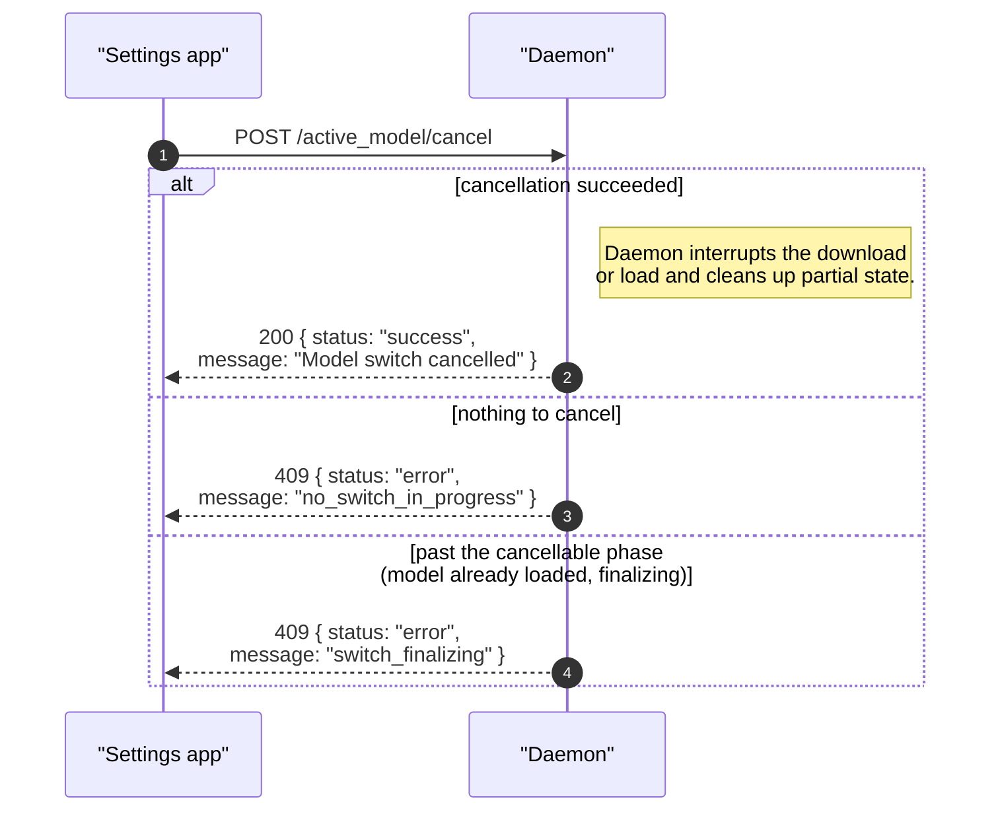
```mermaid
sequenceDiagram
    autonumber
    participant App as "Settings app"
    participant D as "Daemon"

    App->>D: POST /active_model/cancel
    alt cancellation succeeded
        Note right of D: Daemon interrupts the download<br/>or load and cleans up partial state.
        D-->>App: 200 { status: "success",<br/>           message: "Model switch cancelled" }
    else nothing to cancel
        D-->>App: 409 { status: "error",<br/>           message: "no_switch_in_progress" }
    else past the cancellable phase<br/>(model already loaded, finalizing)
        D-->>App: 409 { status: "error",<br/>           message: "switch_finalizing" }
    end
```

`/active_model/cancel` covers both partial-download cleanup and
abort during the loading phase. Once the switch has reached
`verifying` or `ready` it can no longer be cancelled — the active
model has already changed and the right next step is to issue a new
`/active_model` to whatever the user wants instead.

---

## `POST /active_device` / `GET /active_device`

Switch between CPU and CUDA execution. Triggers a model reload.

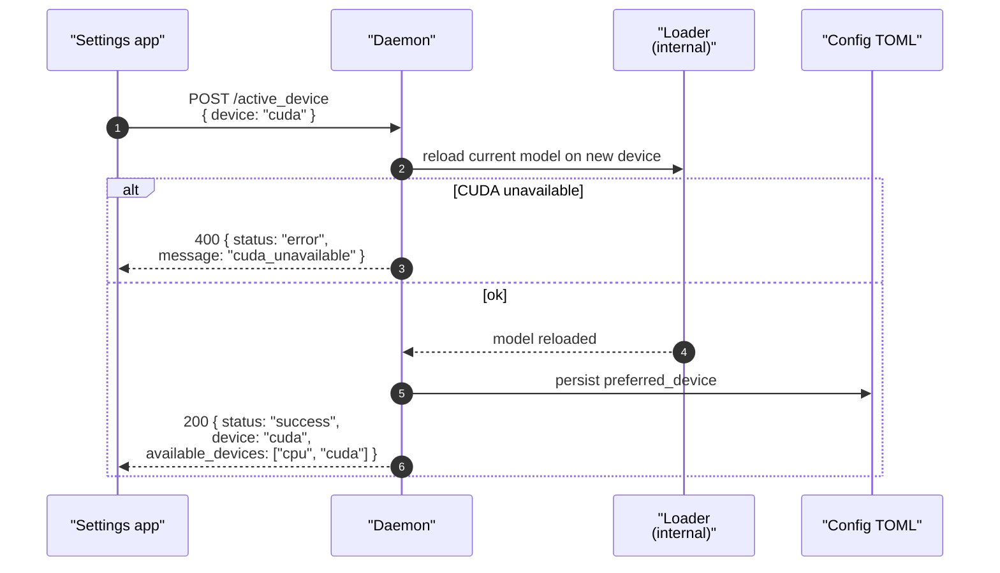
```mermaid
sequenceDiagram
    autonumber
    participant App as "Settings app"
    participant D as "Daemon"
    participant L as "Loader<br/>(internal)"
    participant Cfg as "Config TOML"

    App->>D: POST /active_device<br/>{ device: "cuda" }
    D->>L: reload current model on new device
    alt CUDA unavailable
        D-->>App: 400 { status: "error",<br/>           message: "cuda_unavailable" }
    else ok
        L-->>D: model reloaded
        D->>Cfg: persist preferred_device
        D-->>App: 200 { status: "success",<br/>           device: "cuda",<br/>           available_devices: ["cpu", "cuda"] }
    end
```

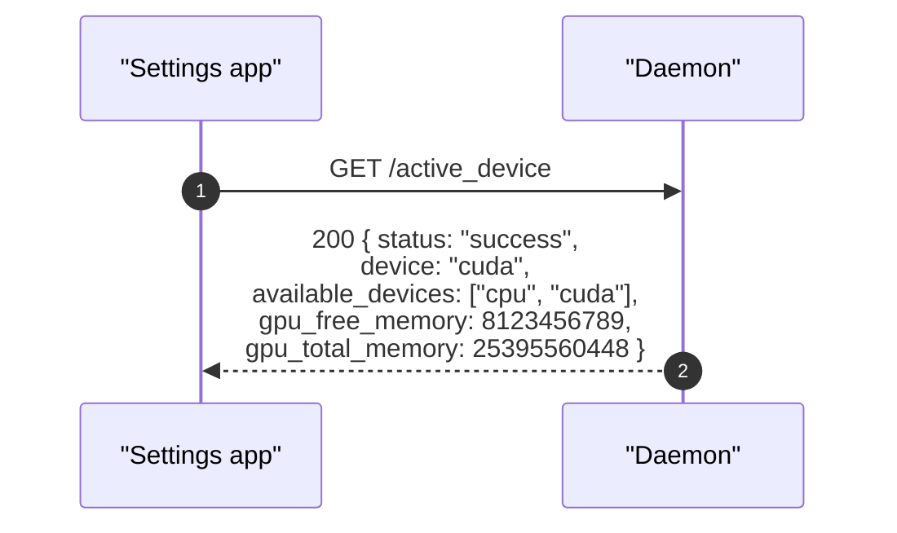
```mermaid
sequenceDiagram
    autonumber
    participant App as "Settings app"
    participant D as "Daemon"

    App->>D: GET /active_device
    D-->>App: 200 { status: "success",<br/>           device: "cuda",<br/>           available_devices: ["cpu", "cuda"],<br/>           gpu_free_memory: 8123456789,<br/>           gpu_total_memory: 25395560448 }
```

---

## `/audio_theme` (POST + GET, plus `/audio_theme/test` and `/audio_themes`)

The audio cue theme that plays on recording start/stop. Themes are named
strings (`classic`, `gentle`, `minimal`, `scifi`, `musical`, `nature`,
`retro`, `silent`).

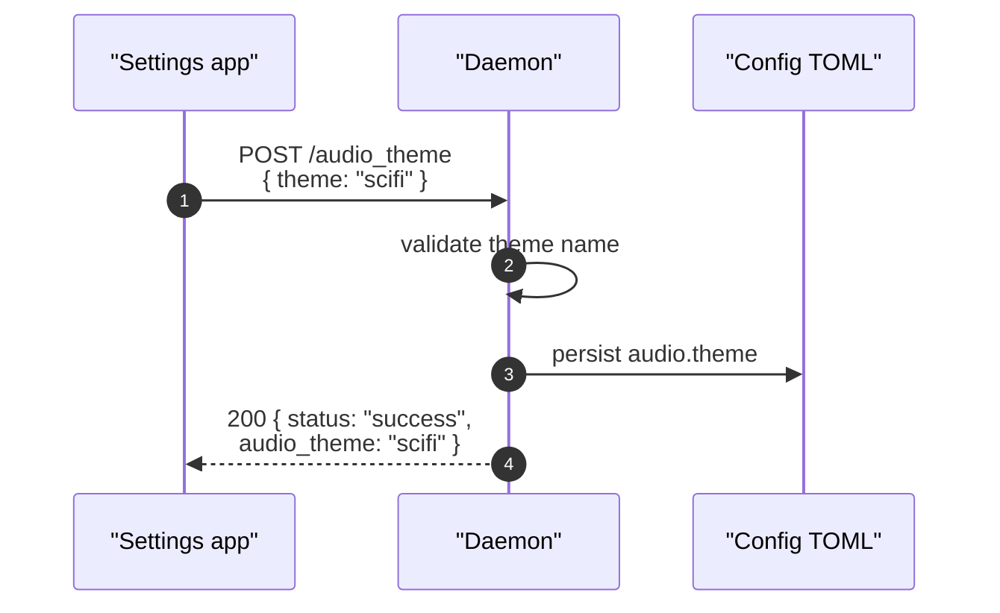
```mermaid
sequenceDiagram
    autonumber
    participant App as "Settings app"
    participant D as "Daemon"
    participant Cfg as "Config TOML"

    App->>D: POST /audio_theme<br/>{ theme: "scifi" }
    D->>D: validate theme name
    D->>Cfg: persist audio.theme
    D-->>App: 200 { status: "success",<br/>           audio_theme: "scifi" }
```

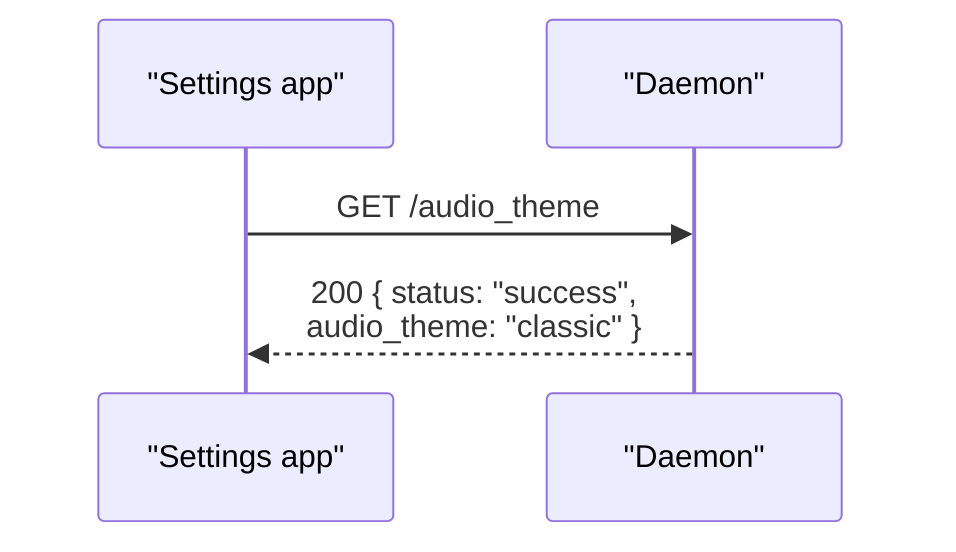
```mermaid
sequenceDiagram
    participant App as "Settings app"
    participant D as "Daemon"

    App->>D: GET /audio_theme
    D-->>App: 200 { status: "success",<br/>           audio_theme: "classic" }
```

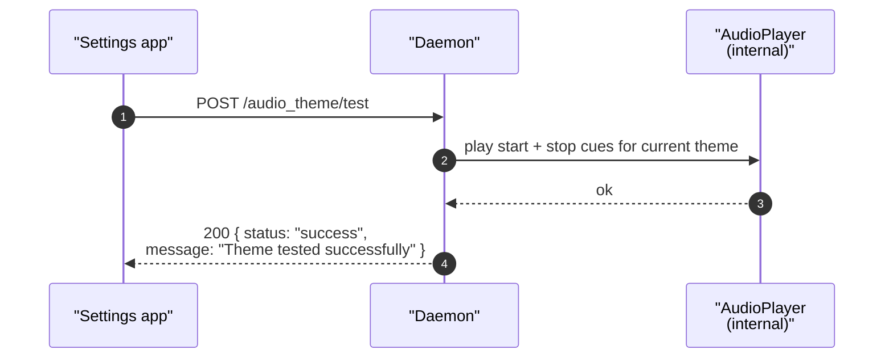
```mermaid
sequenceDiagram
    autonumber
    participant App as "Settings app"
    participant D as "Daemon"
    participant Audio as "AudioPlayer<br/>(internal)"

    App->>D: POST /audio_theme/test
    D->>Audio: play start + stop cues for current theme
    Audio-->>D: ok
    D-->>App: 200 { status: "success",<br/>           message: "Theme tested successfully" }
```

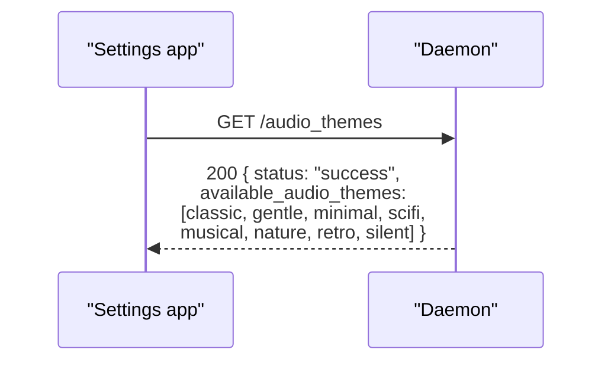
```mermaid
sequenceDiagram
    participant App as "Settings app"
    participant D as "Daemon"

    App->>D: GET /audio_themes
    D-->>App: 200 { status: "success",<br/>           available_audio_themes:<br/>             [classic, gentle, minimal, scifi,<br/>              musical, nature, retro, silent] }
```

---

## `POST /volume` / `GET /volume`

Audio cue volume. `0` mutes the cues without changing the theme; `100`
is full.

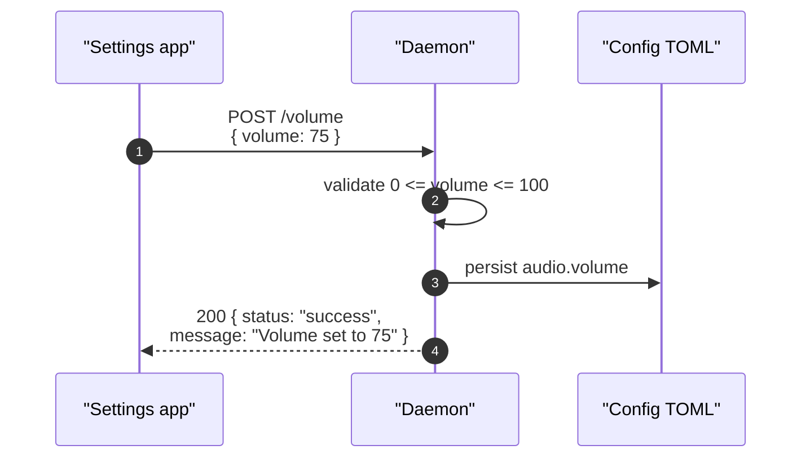
```mermaid
sequenceDiagram
    autonumber
    participant App as "Settings app"
    participant D as "Daemon"
    participant Cfg as "Config TOML"

    App->>D: POST /volume<br/>{ volume: 75 }
    D->>D: validate 0 <= volume <= 100
    D->>Cfg: persist audio.volume
    D-->>App: 200 { status: "success",<br/>           message: "Volume set to 75" }
```

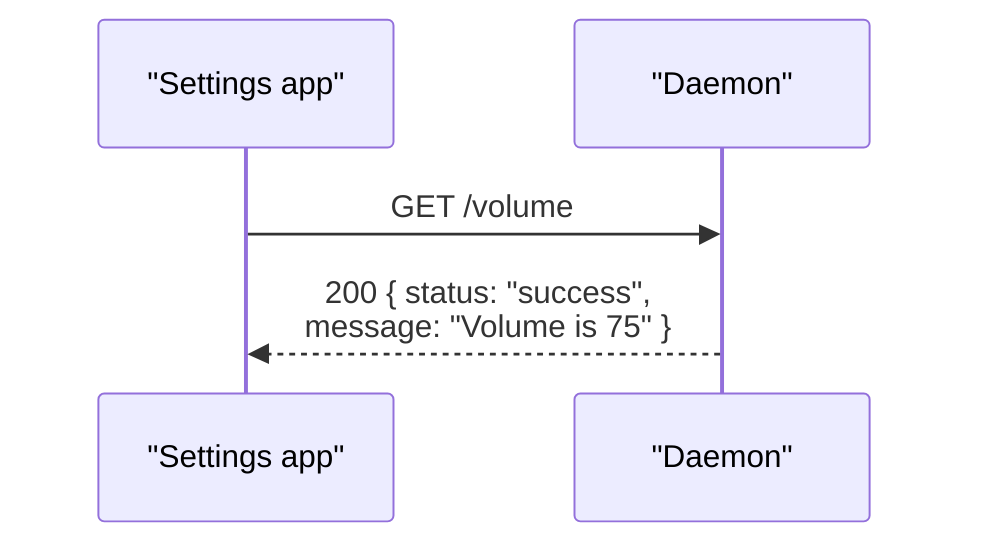
```mermaid
sequenceDiagram
    participant App as "Settings app"
    participant D as "Daemon"

    App->>D: GET /volume
    D-->>App: 200 { status: "success",<br/>           message: "Volume is 75" }
```

---

## `POST /recording_stop_mode` / `GET /recording_stop_mode`

Default stop behavior for `/transcribe` when no per-request `stop_mode`
is sent. One of `silence-only` (auto-stop on silence),
`silence-and-manual` (default — silence VAD plus user toggle), or
`manual-only` (user must press the toggle).

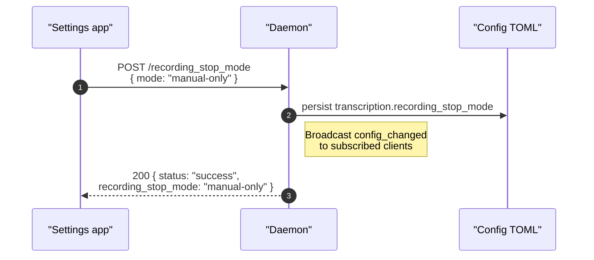
```mermaid
sequenceDiagram
    autonumber
    participant App as "Settings app"
    participant D as "Daemon"
    participant Cfg as "Config TOML"

    App->>D: POST /recording_stop_mode<br/>{ mode: "manual-only" }
    D->>Cfg: persist transcription.recording_stop_mode
    Note right of D: Broadcast config_changed<br/>to subscribed clients
    D-->>App: 200 { status: "success",<br/>           recording_stop_mode: "manual-only" }
```

---

## `POST /write_method` / `GET /write_method`

Controls how the daemon types the transcription back into the active
window when `write_mode = true` is on a `/transcribe` request. One of
`auto`, `xdg-desktop-portal`, `ydotool`, `wayland-protocol`.

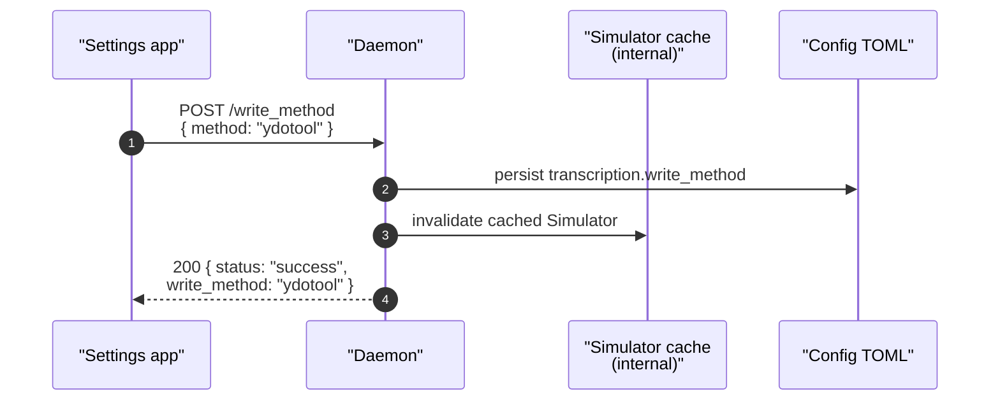
```mermaid
sequenceDiagram
    autonumber
    participant App as "Settings app"
    participant D as "Daemon"
    participant Sim as "Simulator cache<br/>(internal)"
    participant Cfg as "Config TOML"

    App->>D: POST /write_method<br/>{ method: "ydotool" }
    D->>Cfg: persist transcription.write_method
    D->>Sim: invalidate cached Simulator
    D-->>App: 200 { status: "success",<br/>           write_method: "ydotool" }
```

A change here invalidates the cached `Simulator` instance — the next
`/transcribe` rebuilds it with the new method.

---

## `POST /preview_typing` / `GET /preview_typing`

When enabled, the daemon types intermediate transcription text into the
focused window as it's being recognized, instead of waiting for the
final result. Per-recording overrides via `/transcribe { preview }`
take precedence.

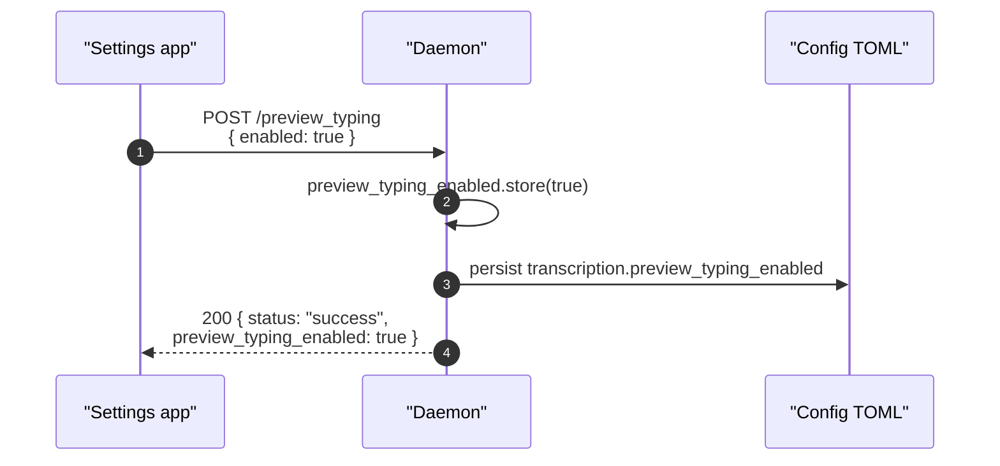
```mermaid
sequenceDiagram
    autonumber
    participant App as "Settings app"
    participant D as "Daemon"
    participant Cfg as "Config TOML"

    App->>D: POST /preview_typing<br/>{ enabled: true }
    D->>D: preview_typing_enabled.store(true)
    D->>Cfg: persist transcription.preview_typing_enabled
    D-->>App: 200 { status: "success",<br/>           preview_typing_enabled: true }
```

---

## `POST /allow_online_models` / `GET /allow_online_models`

The privacy gate. While this is `false`, every attempt to load an online
provider (OpenAI / Mistral / Deepgram) is rejected with `400
online_models_disabled`. Toggling from `true` → `false` while an
online model is loaded reverts to the default local model
automatically.

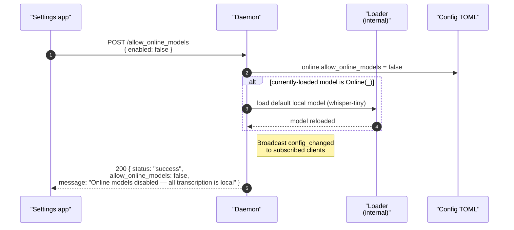
```mermaid
sequenceDiagram
    autonumber
    participant App as "Settings app"
    participant D as "Daemon"
    participant L as "Loader<br/>(internal)"
    participant Cfg as "Config TOML"

    App->>D: POST /allow_online_models<br/>{ enabled: false }
    D->>Cfg: online.allow_online_models = false
    alt currently-loaded model is Online(_)
        D->>L: load default local model (whisper-tiny)
        L-->>D: model reloaded
    end
    Note right of D: Broadcast config_changed<br/>to subscribed clients
    D-->>App: 200 { status: "success",<br/>           allow_online_models: false,<br/>           message: "Online models disabled — all transcription is local" }
```

---

## `POST /custom_models_dir` / `GET /custom_models_dir`

Path where the daemon scans for user-supplied STT models. Setting it
re-scans immediately and the new models become available via
`/models`. Pass `path: null` (or omit) to clear the override and
fall back to the default Hugging Face cache.

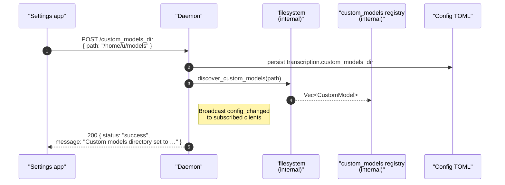
```mermaid
sequenceDiagram
    autonumber
    participant App as "Settings app"
    participant D as "Daemon"
    participant Disk as "filesystem<br/>(internal)"
    participant Reg as "custom_models registry<br/>(internal)"
    participant Cfg as "Config TOML"

    App->>D: POST /custom_models_dir<br/>{ path: "/home/u/models" }
    D->>Cfg: persist transcription.custom_models_dir
    D->>Disk: discover_custom_models(path)
    Disk-->>Reg: Vec<CustomModel>
    Note right of D: Broadcast config_changed<br/>to subscribed clients
    D-->>App: 200 { status: "success",<br/>           message: "Custom models directory set to …" }
```

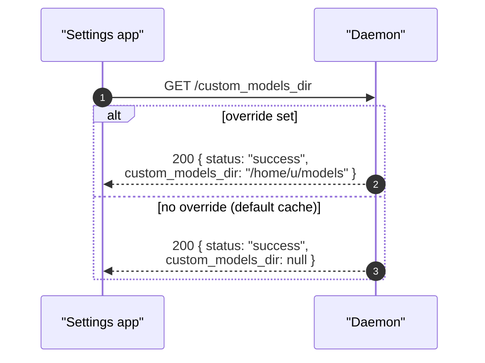
```mermaid
sequenceDiagram
    autonumber
    participant App as "Settings app"
    participant D as "Daemon"

    App->>D: GET /custom_models_dir
    alt override set
        D-->>App: 200 { status: "success",<br/>           custom_models_dir: "/home/u/models" }
    else no override (default cache)
        D-->>App: 200 { status: "success",<br/>           custom_models_dir: null }
    end
```

**Response field (`GET /custom_models_dir`):** `custom_models_dir:
Option<String>` — `null` when no override is configured (the daemon is
using the default Hugging Face cache).

---

## `GET /events` (SSE)

Multiple settings apps can be open at once (the desktop settings UI,
a CLI script that flips a flag, a hotkey daemon adjusting volume, …).
Without notifications, each app would only see its own writes — a
change made elsewhere wouldn't appear until the user manually refreshed.
`GET /events` solves that with a persistent Server-Sent Events stream
that delivers every relevant state change.

`GET /events` is the same endpoint the [widget scope](./widget.md) uses,
but the topic list is broader because settings can read everything.
The byte-level mechanics — how the SSE stream framing and event
delivery work — are in
[transport.md](./transport.md#event-streams-server-sent-events).

### Topics available to the settings scope

| Topic                       | Carries                                                                        |
|-----------------------------|--------------------------------------------------------------------------------|
| `config_changed`            | `{ key, value }` — emitted on any successful settings mutation (model, device, theme, volume, write_method, recording_stop_mode, preview_typing, allow_online_models, custom_models_dir) |
| `model_switch_started`      | `{ target: { model, provider, source }, started_at }`                          |
| `model_switch_progress`     | `{ phase, target, download? }` — the same shape as the `switch` sub-object inside `active_model`, emitted at decision points (not every byte) |
| `model_switch_completed`    | `{ target, completed_at }` — fires once per successful switch                  |
| `model_switch_failed`       | `{ target, error, completed_at }`                                              |
| `recording_started`         | `{ client_id, timestamp, write_mode }`                                         |
| `recording_stopped`         | `{ client_id, timestamp, transcription_success, error }`                       |
| `daemon_status_changed`     | `{ device, model_loaded, current_model }`                                      |

Audio-frame fan-out is **not** delivered to the settings scope — that's
a widget concern. If a settings app needs a meter-style preview during
recording, it should subscribe to `recording_started` /
`recording_stopped` and decide whether to spawn a separate widget-scope
authentication for the audio path.

### Subscribing

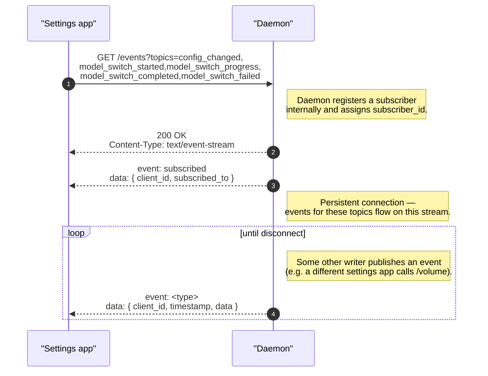
```mermaid
sequenceDiagram
    autonumber
    participant App as "Settings app"
    participant D as "Daemon"

    App->>D: GET /events?topics=config_changed,<br/>      model_switch_started,model_switch_progress,<br/>      model_switch_completed,model_switch_failed
    Note right of D: Daemon registers a subscriber<br/>internally and assigns subscriber_id.
    D-->>App: 200 OK<br/>Content-Type: text/event-stream
    D-->>App: event: subscribed<br/>data: { client_id, subscribed_to }

    Note right of D: Persistent connection —<br/>events for these topics flow on this stream.

    loop until disconnect
        Note right of D: Some other writer publishes an event<br/>(e.g. a different settings app calls /volume).
        D-->>App: event: <type><br/>data: { client_id, timestamp, data }
    end
```

**Initial frame:** `event: subscribed` with `{ client_id: subscriber_id,
subscribed_to: [...] }`.

**Streamed frames:** one SSE `event: <topic>` line per published event
of the form `data: { "client_id", "timestamp", "data" }`. The
`client_id` on each event is the *originating* client (whoever made
the change), not the subscriber.

### Unsubscribing

There's no separate unsubscribe endpoint. Closing the HTTP connection
ends the subscription — the daemon detects the disconnect and reaps
the subscriber.

### Filtering

There is no per-event filter beyond the `topics` selection. A
settings app that only cares about its own writes should suppress
duplicate redraws by comparing the event's `client_id` against the
`client_id` it identifies as locally — but the daemon delivers every
event matching the subscribed topics regardless of origin, because
that's the entire point.

---

## A typical settings session

```mermaid
sequenceDiagram
    autonumber
    participant App as "Settings UI"
    participant D as "Daemon"

    Note over App,D: 1. Authenticate with scope=settings (one time)
    App->>D: POST /auth/request<br/>{ app_name, scope: "settings" }
    D-->>App: 200 { session_token }
    App->>App: persist token in keyring

    Note over App,D: 2. Load current state for the UI
    Note over App,D: One round-trip per setting — on a local Unix socket<br/>this is well under a millisecond total.
    App->>D: GET /models
    D-->>App: { available_models: [...] }
    App->>D: GET /active_model
    D-->>App: { active_model: {<br/>           current: { model, provider, source,<br/>                      loaded, device },<br/>           switch: null<br/>         } }
    App->>D: GET /active_device
    D-->>App: { device, available_devices, gpu_*_memory }
    App->>D: GET /audio_themes
    D-->>App: { available_audio_themes: [...] }
    App->>D: GET /audio_theme
    D-->>App: { audio_theme }
    Note over App,D: ...plus /volume, /write_method,<br/>/recording_stop_mode, /preview_typing,<br/>/allow_online_models, /custom_models_dir

    Note over App,D: 3. Subscribe to cross-app changes (separate connection)
    App->>D: GET /events?topics=config_changed,model_switch_*
    D-->>App: 200 SSE stream<br/>event: subscribed<br/>data: { client_id, subscribed_to }

    Note over App,D: 4. User picks a different model
    App->>D: POST /active_model<br/>{ whisper-base, local_whisper, builtin }
    D-->>App: 202 { message: "Model switch started" }

    Note over App,D: 5. Receive switch progress on the SSE stream
    loop until model_switch_completed (or _failed)
        D-->>App: event: model_switch_progress<br/>data: { phase, download }
    end
    D-->>App: event: model_switch_completed<br/>data: { target }

    Note over App,D: 6. Another app changes a setting elsewhere
    Note over D: a hotkey daemon flips allow_online_models
    D-->>App: event: config_changed<br/>data: { key: "allow_online_models", value: true }
    Note over App: redraws the toggle without a manual refresh
```

The flow above uses two HTTP connections in parallel: one-shot
connections for each command, plus a long-lived SSE connection for
`/events`. Adopting the SSE channel is what removes the "stale UI when
another app made a change" footgun.
