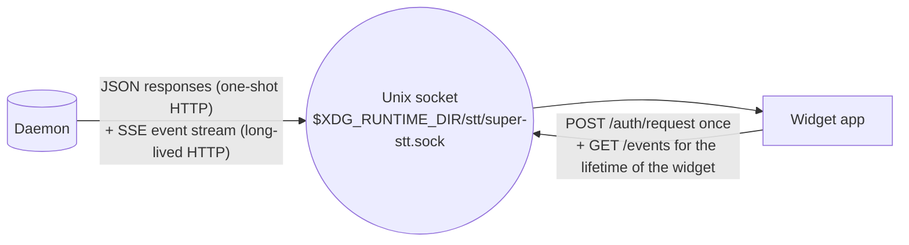
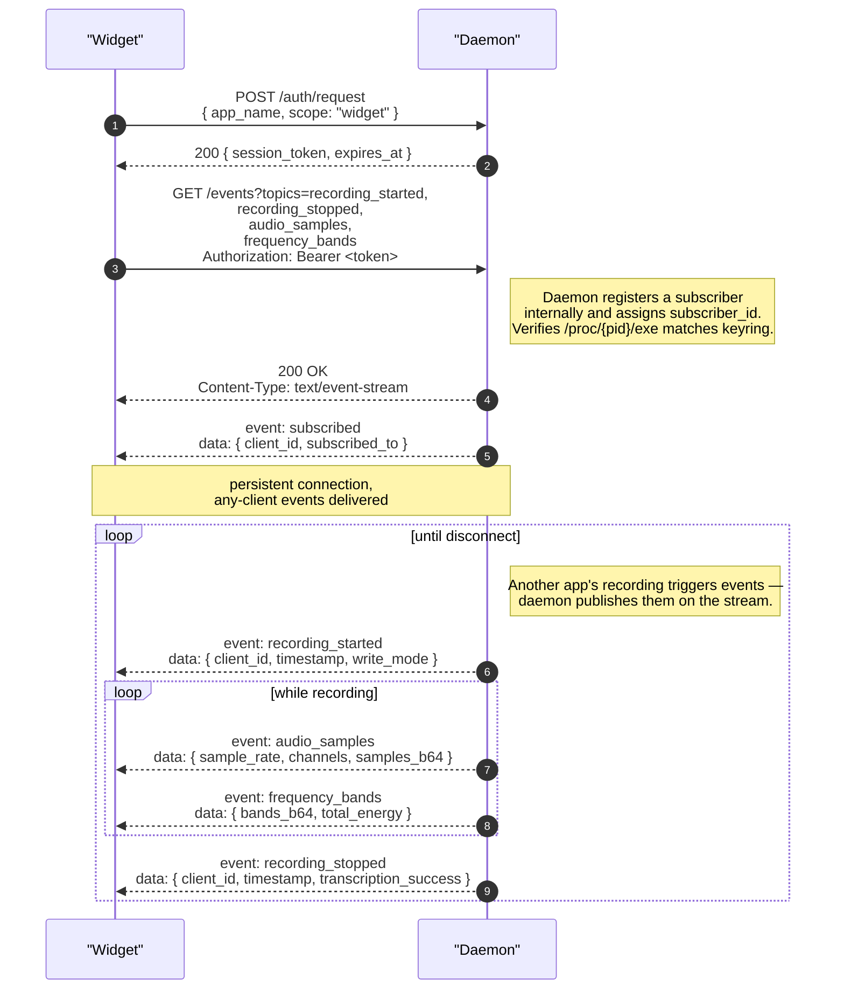
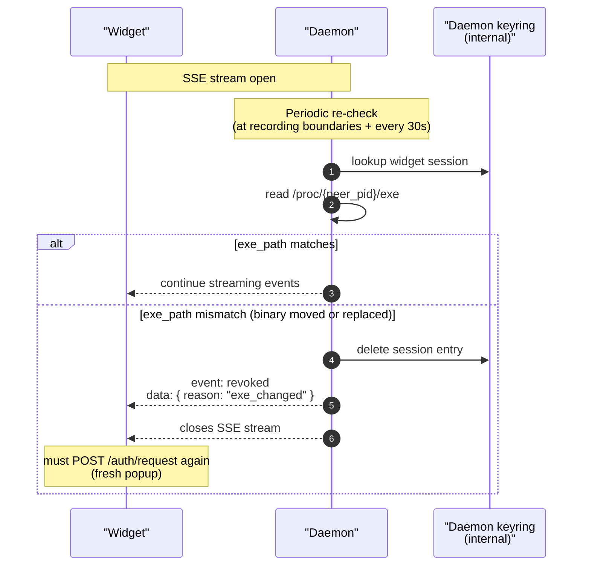
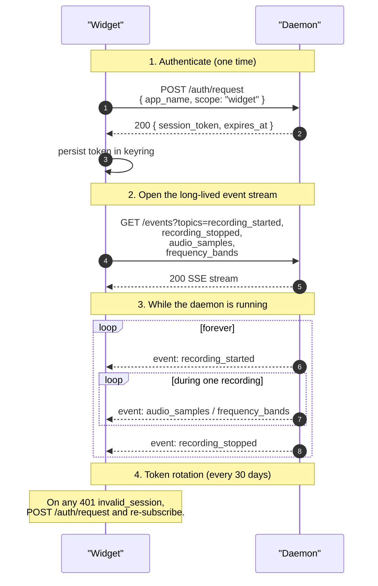

# Widget Protocol

> Scope: **widget** (subscribe-only — no endpoints beyond auth and
> `GET /events`, no configuration access).

The widget protocol is for visualizers, panel applets, and overlays:
anything that displays *what the daemon is doing* without driving the
recording itself. A widget can show:

- Whether a recording is in progress.
- The audio waveform / frequency bands while recording.
- Live or final transcription text (optional opt-in).

A widget cannot:

- Start or stop recording (use [client](./client.md) for that).
- Read or modify any daemon configuration value (use [settings](./settings.md)).
- Issue any other endpoint. The only verbs available to a widget are
  the authentication handshake and `GET /events`.

> The COSMIC applet shipped with this repo is a widget-scope client.

## Why widget is its own scope

The widget receives a continuous broadcast firehose: dozens of audio
frames per second during recording, plus state events. Two
consequences:

1. **A leak is loud.** Even a few seconds of stolen audio frames is a
   privacy event. The daemon detects binary replacement during the
   long-lived SSE connection by re-checking `/proc/<peer_pid>/exe`
   against the keyring entry — see
   [auth.md](./auth.md#widget-anti-replacement).
2. **It must be high-throughput.** Audio frames stream at tens of kB/sec
   during recording. The daemon uses a bounded per-subscriber queue
   that drops oldest frames on overflow rather than backpressuring the
   capture pipeline.

## Single transport

All widget traffic — auth, subscription, audio fan-out, state events —
flows over **one** Unix-socket HTTP connection per stream. There is
no separate UDP listener. See [transport.md](./transport.md) for the
full HTTP shape.

## Endpoints

A widget calls only two endpoints:

| Endpoint              | Method | Purpose                                                     |
|-----------------------|--------|-------------------------------------------------------------|
| `/auth/request`       | POST   | One-time consent (scope = `widget`) — see [auth.md](./auth.md) |
| `/events`             | GET (SSE) | Subscribe to recording state, audio frames, and (optionally) transcription text |

Every other settings-scope or client-scope endpoint returns
`403 scope_denied` for a widget token.

## Topics available to the widget scope

| Topic                  | Carries                                                        |
|------------------------|----------------------------------------------------------------|
| `recording_started`    | `{ client_id, timestamp, write_mode }`                         |
| `recording_stopped`    | `{ client_id, timestamp, transcription_success, error }`       |
| `recording_state`      | `{ is_recording: bool }` — coarse state ping                   |
| `audio_samples`        | `{ sample_rate, channels, samples_b64 }` — base64-encoded f32 PCM |
| `frequency_bands`      | `{ bands_b64, sample_rate, total_energy }` — base64-encoded f32 bands for visualization |
| `partial_stt`          | `{ text, confidence }` — live transcription text (opt-in)      |
| `final_stt`            | `{ text, confidence }` — final transcription text (opt-in)     |

Audio sample and frequency-band payloads use base64 inside the SSE
JSON `data` field. At ~30 KB/s of f32 PCM the encoding overhead
(~33 %) is a rounding error on a local socket. If a widget needs the
absolute most efficient binary path, the daemon may later expose a
`Content-Type: application/octet-stream` chunked variant on a
different endpoint — but most visualizers don't need it.

## Subscribing

The widget chooses its topic set at subscription time. A simple
visualizer might subscribe only to `frequency_bands` +
`recording_started` / `recording_stopped`. A richer overlay could add
`partial_stt` / `final_stt` to show transcription text.

## Anti-replacement re-check

The daemon periodically re-reads `/proc/<peer_pid>/exe` while the SSE
stream is open and compares it to the keyring entry. If the binary
changed, the daemon sends `event: revoked\ndata: { reason:
"exe_changed" }\n\n` and closes the connection. The widget must
re-issue `/auth/request` (which triggers a fresh user popup) before
re-subscribing.

Because the SSE stream runs over the same Unix-socket HTTP connection
as the request that opened it, `SO_PEERCRED` continues to identify
the peer PID throughout the connection's lifetime. There's no need
for an HMAC challenge — the kernel-verified peer credential is the
trust anchor.

For TCP-bound widget clients (browser-based visualizers), peer
credentials aren't available, so the `Origin` header (browser-
enforced) is the trust anchor. Origin checks happen at request
acceptance and on each periodic re-check.

## Errors specific to widgets

| HTTP | `message`                  | Meaning                                                            |
|------|----------------------------|--------------------------------------------------------------------|
| 403  | `scope_denied`             | Widget tried a mutation or non-allowed endpoint — only `/events` and `/auth/*` are allowed |
| 401  | `invalid_session`          | Token expired or `/proc/<pid>/exe` changed; re-issue `/auth/request` |
| 503  | `connection_rejected`      | Resource manager refused the connection                             |

If the daemon detects that a streaming widget has fallen too far
behind, it drops the oldest queued events for that subscriber but
keeps the connection open. The widget will see fresh events once it
catches up; old events are gone.

## A typical widget session

For a working example, look at `super-stt-cosmic-applet`. It opens a
single `GET /events` SSE subscription with `topics=recording_state,
frequency_bands,audio_samples` and routes each event into its
visualization state machine.
